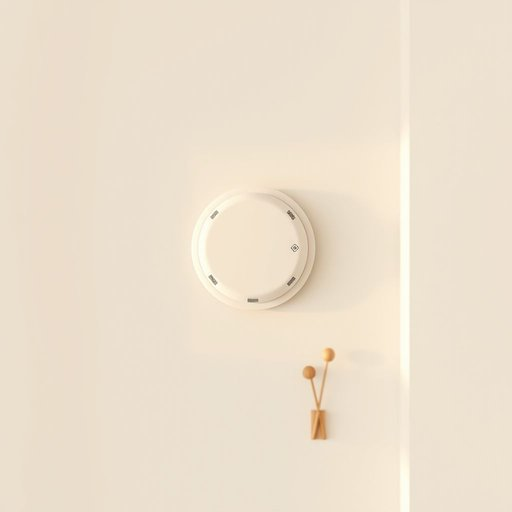

# detector

<h1 style="font-size: 2.5em; font-weight: 300; letter-spacing: 2px; margin: 0; color: #2c3e50;">
/dɪˈtɛktər/
</h1>

---

---

## 例句

Before we start painting the kitchen, could you please check if the smoke detector in the hallway, which has been chirping intermittently for the past week, needs new batteries or a full replacement to ensure our safety?

*Before(/ˌbiˈfɔr/) we(/wi/) start(/stɑrt/) painting(/ˈpeɪnɪŋ/) the(/ðə/) kitchen,(/ˈkɪʧən,/) could(/kʊd/) you(/ju/) please(/pliz/) check(/ʧɛk/) if(/ɪf/) the(/ðə/) smoke(/smoʊk/) detector(/dɪˈtɛktər/) in(/ɪn/) the(/ðə/) hallway,(/ˈhɔlˌweɪ,/) which(/wɪʧ/) has(/həz/) been(/bɪn/) chirping(/ˈʧərpɪŋ/) intermittently(/ˌɪntərˈmɪtəntli/) for(/fər/) the(/ðə/) past(/pæst/) week,(/wik,/) needs(/nidz/) new(/nu/) batteries(/ˈbætəriz/) or(/ər/) a(/ə/) full(/fʊl/) replacement(/rɪˈpleɪsmənt/) to(/tɪ/) ensure(/ɪnˈʃʊr/) our(/ɑr/) safety?(/ˈseɪfti?/)*

**翻译：** 在我们开始粉刷厨房之前，能否请你检查一下走廊里的烟雾报警器？它过去一周时断时续地发出鸣叫声，看看是需要更换电池，还是需要整体更换，以确保我们的安全。

---

## 解释

detector作为名词，在家居生活用品的英语语境中通常指用于检测某种特定物质、状态或现象的装置或设备，比如烟雾探测器（smoke detector）、一氧化碳探测器（carbon monoxide detector）、漏水探测器（water leak detector）等，这些设备用于保障家庭安全和健康。英语学习者在使用detector时应注意其通常作为可数名词出现，常见的搭配有smoke detector、motion detector、gas detector等，其中detector通常用作名词，前面可用定冠词the，或与形容词、名词构成复合词，表达具体的检测对象或功能。语法上，detector一般不用复数形式来指代单个设备，但在描述多种设备或多台设备时可用复数detectors。词源方面，detector源自拉丁语动词detegere，意为揭露、发现，经过法语détecter进入英语，基本含义为发现器、探测器，体现其功能属性。在中文语境中，detector准确翻译为探测器或检测器，具体可根据对象不同译为烟雾探测器、气体报警器等，强调其检测和报警功能。该词在日常家居生活中多带有积极意义，指安全防护设备，无褒贬色彩，广泛用于安全防范领域，反映出现代家庭对安全技术的重视和应用。

---

<small style="color: #999; font-size: 0.9em;">2025-07-17 06:22:39</small>

