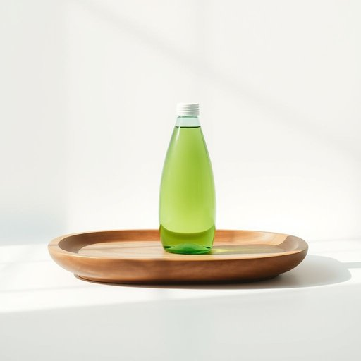

# detergent

<h1 style="font-size: 2.5em; font-weight: 300; letter-spacing: 2px; margin: 0; color: #2c3e50;">
/dɪˈtərʤənt/
</h1>

---

---

## 例句

Although the detergent that was advertised as both environmentally friendly and highly effective on stubborn stains has been on the market for only a few months, many consumers, who previously struggled with allergies and sensitive skin, have reported remarkable improvements after switching to it in their daily cleaning routines.

*Although(/ˌɔlˈðoʊ/) the(/ðə/) detergent(/dɪˈtərʤənt/) that(/ðət/) was(/wɑz/) advertised(/ˌædvərˈtaɪzd/) as(/ɛz/) both(/boʊθ/) environmentally(/ɪnˌvaɪrənˈmɛnəli/) friendly(/ˈfrɛndli/) and(/ənd/) highly(/ˈhaɪli/) effective(/ˈifɛktɪv/) on(/ɔn/) stubborn(/ˈstəbərn/) stains(/steɪnz/) has(/həz/) been(/bɪn/) on(/ɔn/) the(/ðə/) market(/ˈmɑrkɪt/) for(/fər/) only(/ˈoʊnli/) a(/ə/) few(/fju/) months,(/mənθs,/) many(/ˈmɛni/) consumers,(/kənˈsumərz,/) who(/hu/) previously(/ˈpriviəsli/) struggled(/ˈstrəgəld/) with(/wɪθ/) allergies(/ˈælərʤiz/) and(/ənd/) sensitive(/ˈsɛnsɪtɪv/) skin,(/skɪn,/) have(/hæv/) reported(/ˌriˈpɔrtəd/) remarkable(/rɪˈmɑrkəbəl/) improvements(/ˌɪmˈpruvmənts/) after(/ˈæftər/) switching(/sˈwɪʧɪŋ/) to(/tɪ/) it(/ɪt/) in(/ɪn/) their(/ðɛr/) daily(/ˈdeɪli/) cleaning(/ˈklinɪŋ/) routines.(/ruˈtinz./)*

**翻译：** 虽然这款被宣传为既环保又对顽固污渍高效的洗涤剂上市仅数月，但许多曾经饱受过敏和敏感肌肤困扰的消费者在日常清洁时改用它后，均报告了显著的改善效果。

---

## 解释

英语单词“detergent”作为名词在家居生活用品语境中，通常指用于清洁衣物、餐具或其他物品的清洁剂或洗涤剂，具体使用场合多见于描述洗衣、洗碗、清洁家具或卫生间时的产品，如洗衣粉、洗洁精等。在语法上，“detergent”是可数名词，可以用复数形式“detergents”表示不同种类的洗涤剂，常见的搭配有“laundry detergent”（洗衣粉/洗衣液）、“dish detergent”（洗洁精）等，学习者需注意其为物质名词但具可数用法，且通常与量词连用，如“一瓶洗涤剂”。词源方面，“detergent”源自拉丁语“detergere”，意为“擦去、擦净”，由拉丁前缀“de-”（去除）和“tergere”（擦拭）组成，反映了其清洁作用的本质。在中文语境中，“detergent”准确译为“洗涤剂”或“清洁剂”，强调其用于去污和清洁的功能，没有特殊的褒贬义或文化色彩，属于中性词汇，常见于家庭日常生活和商品标识中，因此理解时应结合具体使用场景，如指明是用于衣物还是餐具清洁的洗涤剂，以避免泛泛而谈引起混淆。

---

<small style="color: #999; font-size: 0.9em;">2025-07-17 06:22:39</small>

