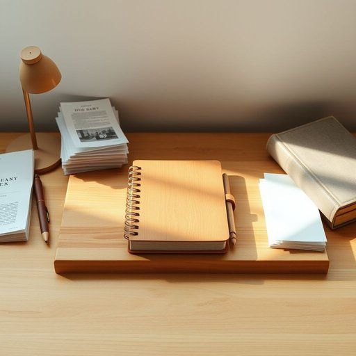

# diary

<h1 style="font-size: 2.5em; font-weight: 300; letter-spacing: 2px; margin: 0; color: #2c3e50;">
/ˈdaɪəri/
</h1>

---

---

## 例句

After searching through all the kitchen drawers and the cluttered bookshelf in the living room, I finally found my diary tucked between a stack of unopened bills and a couple of worn-out cookbooks, where I had absentmindedly placed it last week while trying to keep track of both my appointments and the meal plans for the busy days ahead.

*After(/ˈæftər/) searching(/ˈsərʧɪŋ/) through(/θru/) all(/ɔl/) the(/ðə/) kitchen(/ˈkɪʧən/) drawers(/drɔrz/) and(/ənd/) the(/ðə/) cluttered(/ˈklətərd/) bookshelf(/ˈbʊkˌʃɛlf/) in(/ɪn/) the(/ðə/) living(/ˈlɪvɪŋ/) room,(/rum,/) I(/aɪ/) finally(/ˈfaɪnəli/) found(/faʊnd/) my(/maɪ/) diary(/ˈdaɪəri/) tucked(/təkt/) between(/bɪtˈwin/) a(/ə/) stack(/stæk/) of(/əv/) unopened(/əˈnoʊpənd/) bills(/bɪlz/) and(/ənd/) a(/ə/) couple(/ˈkəpəl/) of(/əv/) worn-out(/worn-out*/) cookbooks,(/ˈkʊkˌbʊks,/) where(/wɛr/) I(/aɪ/) had(/hæd/) absentmindedly(/absentmindedly*/) placed(/pleɪst/) it(/ɪt/) last(/læst/) week(/wik/) while(/waɪl/) trying(/traɪɪŋ/) to(/tɪ/) keep(/kip/) track(/træk/) of(/əv/) both(/boʊθ/) my(/maɪ/) appointments(/əˈpɔɪntmənts/) and(/ənd/) the(/ðə/) meal(/mil/) plans(/plænz/) for(/fər/) the(/ðə/) busy(/ˈbɪzi/) days(/deɪz/) ahead.(/əˈhɛd./)*

**翻译：** 在翻遍厨房所有的抽屉和客厅那杂乱的书架后，我终于在一堆未拆封的账单和几本破旧的食谱之间找到了我的日记，那是我上周一边忙着安排约会一边规划忙碌日子的餐食时，心不在焉地随手放置的。

---

## 解释

英语单词'diary'作为名词，在家居生活用品的语境中通常指用来记录个人日常生活、计划安排或情感经历的日记本或日志本，常见于书桌、书架或家中工作区。具体使用场合多为个人写作、时间管理或回忆录的记录，人们通过该物品整理日常事务或表达内心感受。英语学习者在使用'diary'时应注意它是可数名词，单数形式为'diary'，复数形式为'diaries'，常见搭配包括“keep a diary”（保持写日记的习惯）、“write in a diary”（在日记中写东西）、“diary entry”（日记条目）、“personal diary”（个人日记）等，语法上通常与动作动词如write、keep连用，且强调持续的记录行为。词源上，'diary'来自拉丁语'diarium'，意为“每日的东西”，源于'dies'（日子），最早指每日的记录或账本，逐渐演变为私人日记的含义。在中文语境中，'diary'准确翻译为“日记”，既指记载生活点滴的笔记本，也引申为该类记录的内容，强调个人隐私和情感的表达，没有特别的褒贬色彩，但在文化上常与青少年成长、个人反思以及自我管理联系紧密，具有私密和个人化的文化内涵。

---

<small style="color: #999; font-size: 0.9em;">2025-07-17 06:22:39</small>

