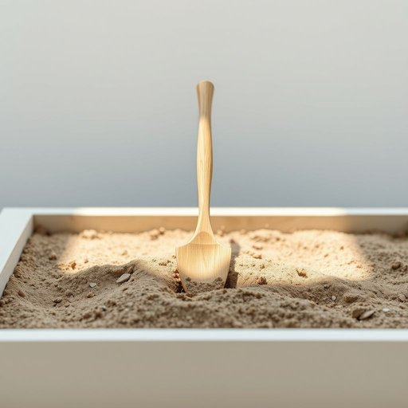

# dibber

<h1 style="font-size: 2.5em; font-weight: 300; letter-spacing: 2px; margin: 0; color: #2c3e50;">
/dibber*/
</h1>

---

---

## 例句

Before you start planting those tiny seeds in the new raised bed, make sure you grab the dibber from the garden shed, as its pointed tip and comfortable handle will help you create perfectly sized holes in the soil, ensuring each seed has the best chance to grow strong and healthy.

*Before(/ˌbiˈfɔr/) you(/ju/) start(/stɑrt/) planting(/ˈplæntɪŋ/) those(/ðoʊz/) tiny(/ˈtaɪni/) seeds(/sidz/) in(/ɪn/) the(/ðə/) new(/nu/) raised(/reɪzd/) bed,(/bɛd,/) make(/meɪk/) sure(/ʃʊr/) you(/ju/) grab(/græb/) the(/ðə/) dibber(/dibber*/) from(/frəm/) the(/ðə/) garden(/ˈgɑrdən/) shed,(/ʃɛd,/) as(/ɛz/) its(/ɪts/) pointed(/ˈpɔɪntɪd/) tip(/tɪp/) and(/ənd/) comfortable(/ˈkəmfərtəbəl/) handle(/ˈhændəl/) will(/wɪl/) help(/hɛlp/) you(/ju/) create(/kriˈeɪt/) perfectly(/ˈpərfəktli/) sized(/saɪzd/) holes(/hoʊlz/) in(/ɪn/) the(/ðə/) soil,(/sɔɪl,/) ensuring(/ɪnˈʃʊrɪŋ/) each(/iʧ/) seed(/sid/) has(/həz/) the(/ðə/) best(/bɛst/) chance(/ʧæns/) to(/tɪ/) grow(/groʊ/) strong(/strɔŋ/) and(/ənd/) healthy.(/ˈhɛlθi./)*

**翻译：** 在你开始在新的高架花坛里种下那些细小的种子之前，务必从花园小屋里拿出植穴器，凭借其尖锐的顶端和舒适的手柄，帮你在土壤中挖出大小恰当的穴位，确保每颗种子都有最佳的成长机会，茁壮健康地发芽。

---

## 解释

英语单词“dibber”作为名词在家居生活用品场景中特指一种园艺工具，通常为细长的木制或塑料制棒状物，一端尖锐，用于在土壤中打孔以便种植种子或小苗。具体使用场合多见于家庭园艺、花园种植或农作物培育时，比如种植蔬菜、花卉时需要先用dibber扎孔以保证种子的深度一致。英语学习者在使用“dibber”时需注意其为可数名词，通常可用复数形式dibbers，常见搭配包括“garden dibber”（园艺种植棒）、“use a dibber to make holes”（用种植棒打孔）等，表达时多与动词“use”、“make”或“push”搭配。语法上，“dibber”基本为具体物品名词，不涉及复杂变形或非谓语动用法。词源方面，“dibber”来自中古英语dibbe，可能源自表示“挖掘”或“挖掘工具”的古词，反映其钻孔功能。中文语境中，“dibber”准确翻译为“种植棒”或“播种棒”，体现其在园艺中用于穴播的功能，属中性词汇，主要体现实用性与园艺工具属性。在文化内涵上，dibber作为小型专业工具在英语国家家庭园艺较常见，反映一定生活细致度及园艺兴趣，但并非广泛普及的生活用品。

---

<small style="color: #999; font-size: 0.9em;">2025-07-17 06:22:39</small>

