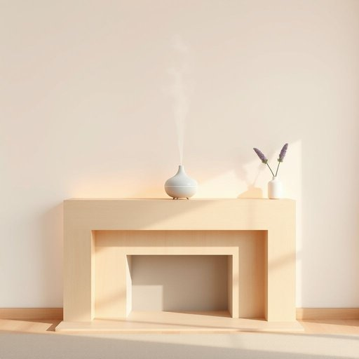

# diffuser

<h1 style="font-size: 2.5em; font-weight: 300; letter-spacing: 2px; margin: 0; color: #2c3e50;">
/diffuser*/
</h1>

---

---

## 例句

I placed the diffuser filled with lavender oil on the mantelpiece, hoping that its gentle mist, which slowly wafts throughout the living room and blends subtly with the warm evening light, would create a calming atmosphere conducive to unwinding after a long day.

*I(/aɪ/) placed(/pleɪst/) the(/ðə/) diffuser(/diffuser*/) filled(/fɪld/) with(/wɪθ/) lavender(/ˈlævəndər/) oil(/ɔɪl/) on(/ɔn/) the(/ðə/) mantelpiece,(/mantelpiece*,/) hoping(/ˈhoʊpɪŋ/) that(/ðət/) its(/ɪts/) gentle(/ˈʤɛnəl/) mist,(/mɪst,/) which(/wɪʧ/) slowly(/sˈloʊli/) wafts(/wafts*/) throughout(/θruaʊt/) the(/ðə/) living(/ˈlɪvɪŋ/) room(/rum/) and(/ənd/) blends(/blɛndz/) subtly(/ˈsətəli/) with(/wɪθ/) the(/ðə/) warm(/wɔrm/) evening(/ˈivnɪŋ/) light,(/laɪt,/) would(/wʊd/) create(/kriˈeɪt/) a(/ə/) calming(/ˈkɑmɪŋ/) atmosphere(/ˈætməsˌfɪr/) conducive(/kənˈdusɪv/) to(/tɪ/) unwinding(/ənˈwaɪndɪŋ/) after(/ˈæftər/) a(/ə/) long(/lɔŋ/) day.(/deɪ./)*

**翻译：** 我将装满薰衣草精油的香薰机放在壁炉架上，期望那缓缓弥漫于客厅、与温暖的晚霞微妙交融的细雾，能营造出一种宁静的氛围，有助于在漫长一天后放松身心。

---

## 解释

英语单词“diffuser”在家居生活用品语境中作为名词，主要指用来扩散香气、光线或空气的装置，常见于香薰机、灯具或空气净化器中。例如，香薰diffuser通过散发精油雾气来改善室内空气质量和营造氛围，灯具中的diffuser则用于均匀分散光线以减少眩光。英语学习者在使用该词时应注意它是可数名词，常搭配动词如“use a diffuser”（使用扩香器）、“turn on the diffuser”（启动扩香器）以及形容词短语如“an essential oil diffuser”（精油扩香器）。“diffuser”一词源于拉丁语“diffundere”，意为“散布、扩散”，反映了其功能属性。在中文语境中，“diffuser”通常译为“扩香器”、“扩散器”或“香薰机”，需根据具体产品功能灵活翻译，避免简单直译成“扩散器”而引起理解偏差。该词在家居用品领域为中性词汇，无褒贬色彩，且多用于提升生活品质的正面语境中，体现现代人追求舒适和健康生活方式的一种生活小物。

---

<small style="color: #999; font-size: 0.9em;">2025-07-17 06:22:39</small>

