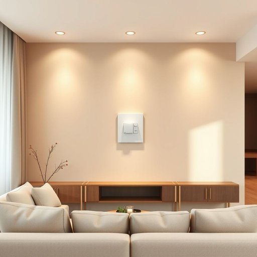

# dimmer

<h1 style="font-size: 2.5em; font-weight: 300; letter-spacing: 2px; margin: 0; color: #2c3e50;">
/ˈdɪmər/
</h1>

---

---

## 例句

Before we invite everyone over for dinner tonight, could you please check if the dimmer on the living room wall, which controls both the chandelier and the recessed spotlights, is working properly to create the perfect ambient lighting without it being too harsh?

*Before(/ˌbiˈfɔr/) we(/wi/) invite(/ˌɪnˈvaɪt/) everyone(/ˈɛvriˌwən/) over(/ˈoʊvər/) for(/fər/) dinner(/ˈdɪnər/) tonight,(/təˈnaɪt,/) could(/kʊd/) you(/ju/) please(/pliz/) check(/ʧɛk/) if(/ɪf/) the(/ðə/) dimmer(/ˈdɪmər/) on(/ɔn/) the(/ðə/) living(/ˈlɪvɪŋ/) room(/rum/) wall,(/wɔl,/) which(/wɪʧ/) controls(/kənˈtroʊlz/) both(/boʊθ/) the(/ðə/) chandelier(/ʃændəˈlɪr/) and(/ənd/) the(/ðə/) recessed(/ˈriˈsɛst/) spotlights,(/ˈspɑˌtlaɪts,/) is(/ɪz/) working(/ˈwərkɪŋ/) properly(/ˈprɑpərli/) to(/tɪ/) create(/kriˈeɪt/) the(/ðə/) perfect(/ˈpərˌfɪkt/) ambient(/ˈæmbiənt/) lighting(/ˈlaɪtɪŋ/) without(/wɪˈθaʊt/) it(/ɪt/) being(/biɪŋ/) too(/tu/) harsh?(/hɑrʃ?/)*

**翻译：** 在今晚邀请大家来家里吃饭之前，能否请你检查一下客厅墙上的调光开关是否正常工作？该开关控制着吊灯和嵌入式射灯，目的是营造出完美的环境光线，而不至于过于刺眼。

---

## 解释

英语单词“dimmer”作为名词，在家居生活用品的语境中，指的是控制灯光亮度的装置，即“调光器”或“调光开关”。具体使用场合多见于灯具安装或家庭装修时，用户通过dimmer调节灯泡发出的光线强弱，从而营造不同的室内氛围或节能效果。在语法使用上，dimmer通常作为可数名词使用，常见固定搭配有“a dimmer switch”（一个调光开关）、“install the dimmer”（安装调光器）、“adjust the dimmer”（调节调光器）等。英语学习者应注意，dimmer不仅指实体设备，有时也泛指调节灯光的功能，但不能直接用作动词。此外，dimmer的形容词形式是“dim”，意为“昏暗的，暗淡的”，而作为名词的dimmer是具体设备。词源方面，dimmer源自动词“dim”的比较级形式，原意为“更暗的”，后转指使光线变暗的装置。中文语境中，dimmer准确的翻译为“调光器”或“调光开关”，强调其功能性和用途，通常无褒贬色彩，是中性且技术性的家居电器名词。综上，dimmer作为家居用品名词指专门调节灯光亮度的开关或装置，表达清晰且应用频繁，是现代居家照明系统中常见且实用的词汇。

---

<small style="color: #999; font-size: 0.9em;">2025-07-17 06:22:39</small>

