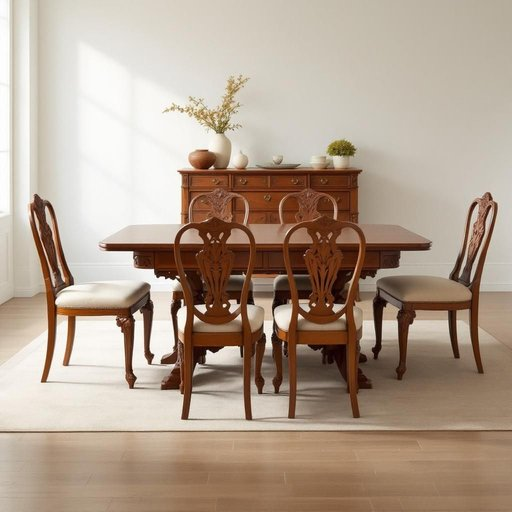

# dining-set

<h1 style="font-size: 2.5em; font-weight: 300; letter-spacing: 2px; margin: 0; color: #2c3e50;">
/dining-set*/
</h1>

---

---

## 例句

After much deliberation over various styles and considering both the size of our dining room and the existing décor, we finally decided to invest in a vintage mahogany dining-set, which not only includes an extendable table and six upholstered chairs but also boasts intricate carvings that add a touch of elegance to our evening meals and weekend gatherings.

*After(/ˈæftər/) much(/məʧ/) deliberation(/dɪˌlɪbərˈeɪʃən/) over(/ˈoʊvər/) various(/ˈvɛriəs/) styles(/staɪlz/) and(/ənd/) considering(/kənˈsɪdərɪŋ/) both(/boʊθ/) the(/ðə/) size(/saɪz/) of(/əv/) our(/ɑr/) dining(/ˈdaɪnɪŋ/) room(/rum/) and(/ənd/) the(/ðə/) existing(/ɪgˈzɪstɪŋ/) décor,(/décor*,/) we(/wi/) finally(/ˈfaɪnəli/) decided(/ˌdɪˈsaɪdɪd/) to(/tɪ/) invest(/ˌɪnˈvɛst/) in(/ɪn/) a(/ə/) vintage(/ˈvɪntɪʤ/) mahogany(/məˈhɑgəni/) dining-set,(/dining-set*,/) which(/wɪʧ/) not(/nɑt/) only(/ˈoʊnli/) includes(/ˌɪnˈkludz/) an(/ən/) extendable(/ˌɛkˈstɛndəbəl/) table(/ˈteɪbəl/) and(/ənd/) six(/sɪks/) upholstered(/əˈpoʊlstərd/) chairs(/ʧɛrz/) but(/bət/) also(/ˈɔlsoʊ/) boasts(/boʊsts/) intricate(/ˈɪntrəkət/) carvings(/ˈkɑrvɪŋz/) that(/ðət/) add(/æd/) a(/ə/) touch(/təʧ/) of(/əv/) elegance(/ˈɛləgəns/) to(/tɪ/) our(/ɑr/) evening(/ˈivnɪŋ/) meals(/milz/) and(/ənd/) weekend(/ˈwiˌkɪnd/) gatherings.(/ˈgæðərɪŋz./)*

**翻译：** 经过多次对各种风格的反复斟酌，并综合考虑了我们餐厅的空间大小及现有的装饰风格，我们最终决定投资购置一套复古的红木餐桌椅。这套餐具不仅包括一张可伸缩的餐桌和六把软垫椅子，还拥有精美细致的雕刻，为我们的晚餐和周末聚会增添了一份优雅的氛围。

---

## 解释

英语单词“dining-set”作为名词，主要指一套用于用餐的家具组合，通常包括餐桌和若干把餐椅，常用于家庭餐厅、厨房用餐区或其他就餐场所。当人们谈论“dining-set”时，通常着重于整体配套的家具，强调其用途和协调性，适合描述家庭或公共场所的用餐环境。学习者在使用该词时应注意其为复合名词，通常作为单数使用，搭配的动词形式需与其单数含义一致，如“The dining-set is new.”常见搭配有“buy a dining-set”（购买餐具套装）、“assemble a dining-set”（组装餐桌椅套装）等，在表达时常与家具、家居装饰等词汇连用。该词源自“dining”（用餐）与“set”（一套、一组）的组合，体现其功能性和整体性，反映了英美等西方国家在家居生活中注重家具成套搭配的文化背景。汉语中的准确翻译为“餐桌椅套装”或“餐具组合”，强调的是家具的成套性，区别于仅指单一的餐桌或餐椅。“dining-set”在中文语境中无特殊褒贬含义或文化色彩，属于中性且常用的家居生活用品术语，适用于家居装修、家具购买及室内设计等语境。

---

<small style="color: #999; font-size: 0.9em;">2025-07-17 06:22:39</small>

