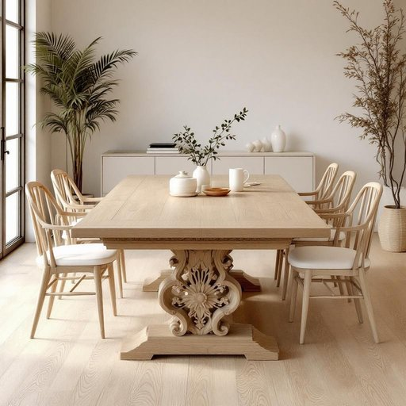

# dining-table

<h1 style="font-size: 2.5em; font-weight: 300; letter-spacing: 2px; margin: 0; color: #2c3e50;">
/dining-table*/
</h1>

---

---

## 例句

Although the dining-table, which we inherited from my grandmother and has a beautifully carved oak surface, often serves as the central gathering spot for family meals, it also doubles as a workspace for my children’s homework and occasional art projects, thereby making it an indispensable piece of furniture in our daily household routine.

*Although(/ˌɔlˈðoʊ/) the(/ðə/) dining-table,(/dining-table*,/) which(/wɪʧ/) we(/wi/) inherited(/ˌɪnˈhɛrətɪd/) from(/frəm/) my(/maɪ/) grandmother(/ˈgrændˌməðər/) and(/ənd/) has(/həz/) a(/ə/) beautifully(/ˈbjutəfli/) carved(/kɑrvd/) oak(/oʊk/) surface,(/ˈsərfəs,/) often(/ˈɔfən/) serves(/sərvz/) as(/ɛz/) the(/ðə/) central(/ˈsɛntrəl/) gathering(/ˈgæðərɪŋ/) spot(/spɑt/) for(/fər/) family(/ˈfæməli/) meals,(/milz,/) it(/ɪt/) also(/ˈɔlsoʊ/) doubles(/ˈdəbəlz/) as(/ɛz/) a(/ə/) workspace(/workspace*/) for(/fər/) my(/maɪ/) children’s(/children’s*/) homework(/ˈhoʊmˌwərk/) and(/ənd/) occasional(/ɔˈkeɪʒənəl/) art(/ɑrt/) projects,(/ˈprɑʤɛkts,/) thereby(/ˈðɛrˈbaɪ/) making(/ˈmeɪkɪŋ/) it(/ɪt/) an(/ən/) indispensable(/ˌɪndɪˈspɛnsəbəl/) piece(/pis/) of(/əv/) furniture(/ˈfərnɪʧər/) in(/ɪn/) our(/ɑr/) daily(/ˈdeɪli/) household(/ˈhaʊsˌhoʊld/) routine.(/ruˈtin./)*

**翻译：** 虽然这张餐桌是我们从祖母那里继承下来的，拥有精美雕刻的橡木桌面，经常作为家庭用餐的核心聚集点，但它同时也是孩子们完成家庭作业和偶尔的艺术创作的工作台，因此成为我们日常生活中不可或缺的一件家具。

---

## 解释

英语单词“dining-table”作为名词，指的是家居生活中用于吃饭的桌子，通常摆放在餐厅或厨房等用餐区域，是家庭用餐场合的重要家具。使用时多见于描述家居布置、装修、家具购物或家庭生活场景中，例如“The dining-table is large enough to seat six people”（这张餐桌足够容纳六个人）。学习者需要注意，“dining-table”是一个复合名词，由“dining”（与用餐相关的）和“table”（桌子）组成，通常作单数或复数使用时变为“dining-tables”，前者作定语修饰后者，二者紧密结合表达固定含义。它还常与动词搭配，如“set the dining-table”（摆餐具）、“clean the dining-table”（擦拭餐桌），以及与形容词搭配如“large dining-table”、“round dining-table”等，注意词形和搭配的自然运用。词源上，“dining”来源于动词“dine”表示“吃饭”，而“table”则来自拉丁语“tabula”，意为平板或桌板，合成词反映了功能和形态的结合，没有特殊的褒贬色彩或文化隐喻，属于中性词汇。在中文语境中，“dining-table”准确翻译为“餐桌”，指家中专门用来用餐的桌子，是一个常见且明确的家具名称，表达上应避免混淆为其他类型的桌子如写字台或茶几，其功能性和使用环境较为明确。整体而言，掌握“dining-table”的使用有助于准确描述家居布置和日常生活场景，体现出英语中的复合名词构成和固定搭配特点。

---

<small style="color: #999; font-size: 0.9em;">2025-07-17 06:22:39</small>

