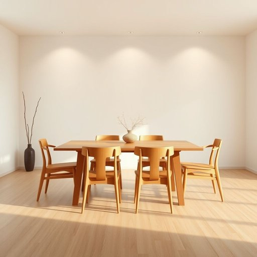

# dining

<h1 style="font-size: 2.5em; font-weight: 300; letter-spacing: 2px; margin: 0; color: #2c3e50;">
/ˈdaɪnɪŋ/
</h1>

---

---

## 例句

The dining experience at the new restaurant, enhanced by the ambient lighting, eclectic music, and meticulously crafted menu, offers not only a feast for the palate but also an immersive cultural journey that delights all the senses.

*The(/ðə/) dining(/ˈdaɪnɪŋ/) experience(/ɪkˈspɪriəns/) at(/æt/) the(/ðə/) new(/nu/) restaurant,(/ˈrɛˌstrɑnt,/) enhanced(/ɛnˈhænst/) by(/baɪ/) the(/ðə/) ambient(/ˈæmbiənt/) lighting,(/ˈlaɪtɪŋ,/) eclectic(/ɪˈklɛktɪk/) music,(/mˈjuzɪk,/) and(/ənd/) meticulously(/məˈtɪkjələsli/) crafted(/ˈkræftɪd/) menu,(/ˈmɛnju,/) offers(/ˈɔfərz/) not(/nɑt/) only(/ˈoʊnli/) a(/ə/) feast(/fist/) for(/fər/) the(/ðə/) palate(/ˈpælɪt/) but(/bət/) also(/ˈɔlsoʊ/) an(/ən/) immersive(/immersive*/) cultural(/ˈkəlʧərəl/) journey(/ˈʤərni/) that(/ðət/) delights(/dɪˈlaɪts/) all(/ɔl/) the(/ðə/) senses.(/ˈsɛnsɪz./)*

**翻译：** 这家新餐厅的用餐体验，在柔和的灯光、丰富多样的音乐以及精心打造的菜单的衬托下，不仅为味蕾带来盛宴，更是一场令人沉浸其中、愉悦感官的文化之旅。

---

## 解释

“dining”作为名词在家居生活用品领域中，通常指的是“用餐”或“进餐”的概念，特别是与吃饭相关的空间或环境，如“dining room”（餐厅）或“dining area”（用餐区）。具体使用场合多见于描述家庭或餐厅中专门供就餐使用的房间、家具及相关用品，如dining table（餐桌）、dining chairs（餐椅）等。英语学习者在使用dining作为名词时需注意，它本身多用作形容词用于构成复合名词，而直接作“用餐”时常用复合词或短语（如dining room、dining hall），单独使用dining作为名词较少且偏正式，语法上要注意搭配名词而非独立使用。常见搭配有dining area、dining room、dining experience等。词源上，dining源于动词dine的现在分词形式，dine起源于中世纪英语，来自法语中的diner，原意是“正餐”，进一步追溯到拉丁语中的“junare”，意指午饭或正餐，体现了用餐这一核心生活行为。中文语境中，“dining”准确翻译为“用餐”或“吃饭”，在描述家居环境时往往音译为“餐厅”或“用餐区”。它本身无明显褒贬色彩，属于中性词汇，更多体现生活习惯和文化中用餐的空间及活动，是家庭生活中重要的组成部分。综上，学习使用“dining”时应结合具体语境，注意其作为形容词的广泛用途和作为名词时的固定搭配，理解其文化背景可助于准确和自然地表达与家庭用餐相关的内容。

---

<small style="color: #999; font-size: 0.9em;">2025-07-17 06:22:39</small>

