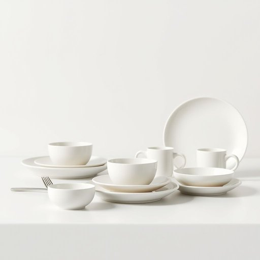

# dinner-set

<h1 style="font-size: 2.5em; font-weight: 300; letter-spacing: 2px; margin: 0; color: #2c3e50;">
/dinner-set*/
</h1>

---

---

## 例句

After much deliberation over style and durability, she finally chose a vintage porcelain dinner-set, complete with delicate floral patterns and gold trim, which not only enhanced the elegance of her dining room but also promised to withstand the rigours of daily family meals and occasional formal dinner parties.

*After(/ˈæftər/) much(/məʧ/) deliberation(/dɪˌlɪbərˈeɪʃən/) over(/ˈoʊvər/) style(/staɪl/) and(/ənd/) durability,(/dərəˈbɪlɪti,/) she(/ʃi/) finally(/ˈfaɪnəli/) chose(/ʧoʊz/) a(/ə/) vintage(/ˈvɪntɪʤ/) porcelain(/ˈpɔrsələn/) dinner-set,(/dinner-set*,/) complete(/kəmˈplit/) with(/wɪθ/) delicate(/ˈdɛləkət/) floral(/ˈflɔrəl/) patterns(/ˈpætərnz/) and(/ənd/) gold(/goʊld/) trim,(/trɪm,/) which(/wɪʧ/) not(/nɑt/) only(/ˈoʊnli/) enhanced(/ɛnˈhænst/) the(/ðə/) elegance(/ˈɛləgəns/) of(/əv/) her(/hər/) dining(/ˈdaɪnɪŋ/) room(/rum/) but(/bət/) also(/ˈɔlsoʊ/) promised(/ˈprɑməst/) to(/tɪ/) withstand(/wɪθˈstænd/) the(/ðə/) rigours(/rigours*/) of(/əv/) daily(/ˈdeɪli/) family(/ˈfæməli/) meals(/milz/) and(/ənd/) occasional(/ɔˈkeɪʒənəl/) formal(/ˈfɔrməl/) dinner(/ˈdɪnər/) parties.(/ˈpɑrtiz./)*

**翻译：** 经过反复斟酌款式与耐用性后，她最终选定了一套复古瓷器餐具，配以精致的花卉图案和金边装饰，这不仅提升了餐厅的典雅氛围，也确保能够经受日常家庭用餐和偶尔正式晚宴的考验。

---

## 解释

dinner-set作为名词，指的是一套用于正式或日常用餐的餐具组合，通常包括餐盘、碟子、碗、杯子及相应的餐具，常见于家居生活用品中，用于摆放餐桌、举办家庭聚餐或招待宾客时。具体使用场合多为购物、布置餐厅或描述厨房用具时，比如“I bought a new dinner-set for the holiday dinner”（我买了一套餐具为节日晚餐准备）。英语学习者需注意该词为复合名词，通常作为单数使用，表示一整套餐具集合，且动词搭配时要根据上下文决定，比如“have a dinner-set”不合适，通常用“buy a dinner-set”或“use a dinner-set”。常见搭配包括“porcelain dinner-set”（瓷制餐具套装）、“complete dinner-set”（全套餐具）等。词源方面，“dinner”指正餐，特别是晚餐，“set”指一组配套的物品，将两者合成表示一组专门为正餐设计的餐具。中文中，准确翻译为“餐具套装”或“餐具一套”，语义上强调成套和配套使用，和单个餐具不同。该词本身无褒贬含义，属于中性词汇，在文化层面体现的是对用餐环境整洁规范和仪式感的重视，常见于中高端家居用品描述中，象征着家庭生活质量和礼仪的提升。

---

<small style="color: #999; font-size: 0.9em;">2025-07-17 06:22:39</small>

