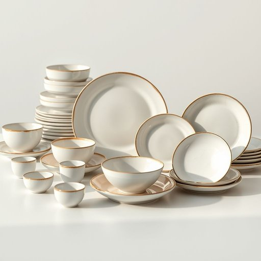

# dinnerware

<h1 style="font-size: 2.5em; font-weight: 300; letter-spacing: 2px; margin: 0; color: #2c3e50;">
/ˈdɪnərˌwɛr/
</h1>

---

---

## 例句

Although the fragile dinnerware, which my grandmother carefully collected over decades of traveling through Europe, was packed securely in several layers of bubble wrap, a few pieces still arrived chipped and cracked, much to our disappointment during the holiday preparations.

*Although(/ˌɔlˈðoʊ/) the(/ðə/) fragile(/ˈfræʤəl/) dinnerware,(/ˈdɪnərˌwɛr,/) which(/wɪʧ/) my(/maɪ/) grandmother(/ˈgrændˌməðər/) carefully(/ˈkɛrfəli/) collected(/kəˈlɛktəd/) over(/ˈoʊvər/) decades(/ˈdɛkeɪdz/) of(/əv/) traveling(/ˈtrævəlɪŋ/) through(/θru/) Europe,(/ˈjʊrəp,/) was(/wɑz/) packed(/pækt/) securely(/sɪˈkjʊrli/) in(/ɪn/) several(/ˈsɛvərəl/) layers(/leɪərz/) of(/əv/) bubble(/ˈbəbəl/) wrap,(/ræp,/) a(/ə/) few(/fju/) pieces(/ˈpisɪz/) still(/stɪl/) arrived(/əraɪvd/) chipped(/ʧɪpt/) and(/ənd/) cracked,(/krækt,/) much(/məʧ/) to(/tɪ/) our(/ɑr/) disappointment(/ˌdɪsəˈpɔɪntmənt/) during(/ˈdʊrɪŋ/) the(/ðə/) holiday(/ˈhɑlɪˌdeɪ/) preparations.(/ˌprɛpərˈeɪʃənz./)*

**翻译：** 虽然那些由我祖母经过数十年欧洲旅行精心收藏的易碎餐具被多层气泡膜严密包裹，但其中几件仍在运送过程中出现了崩边和裂纹，这让我们在假期准备期间感到格外失望。

---

## 解释

英语单词"dinnerware"作为名词，主要指用于进餐时盛装和摆放食物的器皿和餐具，包含盘子、碗、杯子、碟子等，通常出现在家庭餐厅、厨房、餐厅陈设或购物场合，语境多涉及餐饮准备、家居布置或餐具购物；学习者使用时需注意其不可数名词属性，通常作为整体概念使用，不宜直接加复数形式，但可用具体名词复数替代，如plates, bowls等，常见搭配包括"dinnerware set"（餐具套装）和"porcelain dinnerware"（瓷制餐具），表达时可结合形容词表材质或风格，增强描述准确度；词源源自晚餐（dinner）与器皿（ware）组合，"dinner"起源于古法语及拉丁语，用以指正餐，"ware"意指器具，因此合成词指供正餐使用的器皿，反映了其功能属性；在中文语境中，准确翻译为“餐具”或更具体的“餐具器皿”，强调其在家居生活中的功能性和实用性，无褒贬色彩，属于中性词汇，强调日常生活中用以盛装食物的必备用品，文化内涵体现了西方餐桌文化中的整洁与礼仪习惯。

---

<small style="color: #999; font-size: 0.9em;">2025-07-17 06:22:39</small>

