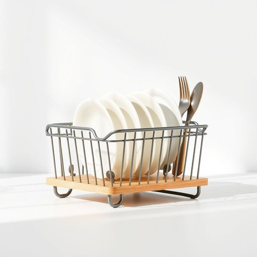

# dish-rack

<h1 style="font-size: 2.5em; font-weight: 300; letter-spacing: 2px; margin: 0; color: #2c3e50;">
/dish-rack*/
</h1>

---

---

## 例句

After washing the pots and pans, she carefully arranged the delicate china and sturdy cutlery in the dish-rack, which, despite its compact size, managed to hold everything securely while allowing air to circulate freely for optimal drying.

*After(/ˈæftər/) washing(/ˈwɑʃɪŋ/) the(/ðə/) pots(/pɑts/) and(/ənd/) pans,(/pænz,/) she(/ʃi/) carefully(/ˈkɛrfəli/) arranged(/əreɪnʤd/) the(/ðə/) delicate(/ˈdɛləkət/) china(/ˈʧaɪnə/) and(/ənd/) sturdy(/ˈstərdi/) cutlery(/ˈkətləri/) in(/ɪn/) the(/ðə/) dish-rack,(/dish-rack*,/) which,(/wɪʧ,/) despite(/dɪˈspaɪt/) its(/ɪts/) compact(/ˈkɑmpækt/) size,(/saɪz,/) managed(/ˈmænɪʤd/) to(/tɪ/) hold(/hoʊld/) everything(/ˈɛvriˌθɪŋ/) securely(/sɪˈkjʊrli/) while(/waɪl/) allowing(/əˈlaʊɪŋ/) air(/ɛr/) to(/tɪ/) circulate(/ˈsərkjəˌleɪt/) freely(/ˈfrili/) for(/fər/) optimal(/ˈɑptɪməl/) drying.(/draɪɪŋ./)*

**翻译：** 洗净锅碗瓢盆后，她小心翼翼地将精致的瓷器和结实的餐具整齐地摆放在沥水架上。尽管沥水架体积紧凑，却能牢牢承载所有物品，同时又允许空气自由流通，确保最佳的干燥效果。

---

## 解释

英语单词"dish-rack"作为名词，指的是厨房中用来晾干或摆放洗净餐具的架子，通常由金属丝或塑料制成，形状多为平板带有槽，便于放置碟子、杯子和刀叉等，常见于家庭厨房或餐厅环境中。学习者在使用"dish-rack"时应注意它是可数名词，通常用复数形式"dish-racks"表示多个此类物品，在表达时可与定冠词the连用，例如"the dish-rack is full"，或用不定冠词a表示单个物件，如"a dish-rack on the counter"。此外，该词常与表示动作的动词搭配，例如"use a dish-rack"（使用碟架）、"dry dishes on the dish-rack"（在碟架上晾干餐具）、"empty the dish-rack"（清空碟架）等。"Dish-rack"一词来自于"dish"（碟子、盘子）与"rack"（架子）的组合，为合成词，其构成符合英语中名词复合结构的常见模式，直观表达了物品的功能和用途。在中文语境中，"dish-rack"精准对应为“碟架”或“碗碟架”，强调其在厨房中用于放置和晾晒餐具的实用功能，词义中性且无褒贬色彩，属于日常生活中常见的家庭用品名称，没有特殊文化隐喻或情感色彩，学习时应结合具体家居环境理解其使用场景和功能，避免将其误解为其他类型的“架子”。

---

<small style="color: #999; font-size: 0.9em;">2025-07-17 06:22:39</small>

