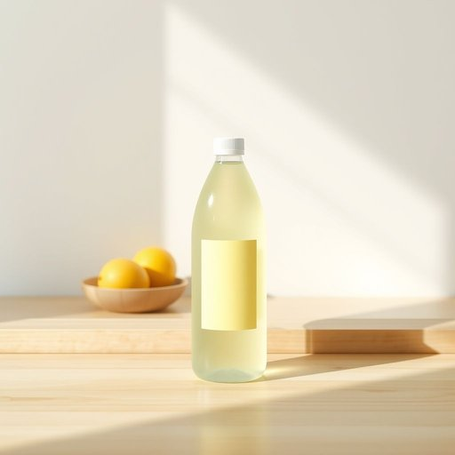

# dish-soap

<h1 style="font-size: 2.5em; font-weight: 300; letter-spacing: 2px; margin: 0; color: #2c3e50;">
/dish-soap*/
</h1>

---

---

## 例句

Could you please pass me the bottle of lemon-scented dish-soap from under the sink, as it is both effective at cutting grease and gentle on delicate china, so I can finish washing the dishes before dinner?

*Could(/kʊd/) you(/ju/) please(/pliz/) pass(/pæs/) me(/mi/) the(/ðə/) bottle(/ˈbɑtəl/) of(/əv/) lemon-scented(/lemon-scented*/) dish-soap(/dish-soap*/) from(/frəm/) under(/ˈəndər/) the(/ðə/) sink,(/sɪŋk,/) as(/ɛz/) it(/ɪt/) is(/ɪz/) both(/boʊθ/) effective(/ˈifɛktɪv/) at(/æt/) cutting(/ˈkətɪŋ/) grease(/gris/) and(/ənd/) gentle(/ˈʤɛnəl/) on(/ɔn/) delicate(/ˈdɛləkət/) china,(/ˈʧaɪnə,/) so(/soʊ/) I(/aɪ/) can(/kən/) finish(/ˈfɪnɪʃ/) washing(/ˈwɑʃɪŋ/) the(/ðə/) dishes(/ˈdɪʃɪz/) before(/ˌbiˈfɔr/) dinner?(/ˈdɪnər?/)*

**翻译：** 请您把水槽下的柠檬香味洗洁精递给我好吗？它既能有效去除油渍，又对细致的瓷器温和，这样我就能在晚餐前洗完碗碟。

---

## 解释

英语单词“dish-soap”作为名词主要指用于洗涤餐具的液体清洁剂，常见于家庭厨房环境中，特别是在清洗碗碟、锅具等油腻或残留食物的用品时使用。其具体使用场合通常是在谈论厨房清洁用品、日常家务或购物清单时出现，如“I need to buy some dish-soap”（我需要买些洗洁精）。英语学习者在使用“dish-soap”时应注意其复数形式为“dish soaps”，且通常作为不可数名词使用时前面不加冠词，比如“Dish soap is important for kitchen hygiene”。在搭配方面，常见表达有“liquid dish-soap”（液体洗洁精）、“concentrated dish-soap”（浓缩洗洁精），以及诸如“use dish-soap to clean the dishes”（用洗洁精清洗餐具）等句式。该词组由“dish”（餐具）和“soap”（肥皂、清洁剂）组合而成，起源于工业化生产洗涤剂的时期，用以特指专门针对餐具油污设计的清洁产品，区别于一般手洗肥皂或浴室用皂。在中文语境中，“dish-soap”通常准确翻译为“洗洁精”或“洗碗液”，强调其液体形态和用途，区别于固体皂块，且无特别的褒贬含义或文化色彩，仅为中性家用清洁用品的称呼。总体来说，“dish-soap”在家居生活用品语境中是一个专指且实用的名词，学习时需结合厨房清洁相关话题灵活运用。

---

<small style="color: #999; font-size: 0.9em;">2025-07-17 06:22:39</small>

