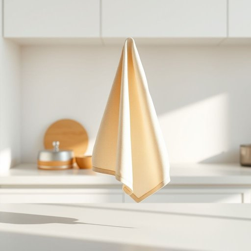

# dish-towel

<h1 style="font-size: 2.5em; font-weight: 300; letter-spacing: 2px; margin: 0; color: #2c3e50;">
/dish-towel*/
</h1>

---

---

## 例句

Despite the complexities of the project, the diligent team managed to synchronize their efforts seamlessly, ensuring the successful launch of the innovative software that revolutionized the industry.

*Despite(/dɪˈspaɪt/) the(/ðə/) complexities(/kəmˈplɛksɪtiz/) of(/əv/) the(/ðə/) project,(/ˈprɑʤɛkt,/) the(/ðə/) diligent(/ˈdɪlɪʤənt/) team(/tim/) managed(/ˈmænɪʤd/) to(/tɪ/) synchronize(/ˈsɪŋkrəˌnaɪz/) their(/ðɛr/) efforts(/ˈɛfərts/) seamlessly,(/ˈsimləsli,/) ensuring(/ɪnˈʃʊrɪŋ/) the(/ðə/) successful(/səkˈsɛsfəl/) launch(/lɔnʧ/) of(/əv/) the(/ðə/) innovative(/ˈɪnəˌveɪtɪv/) software(/ˈsɔfˌwɛr/) that(/ðət/) revolutionized(/ˌrɛvəˈluʃəˌnaɪzd/) the(/ðə/) industry.(/ˈɪndəstri./)*

**翻译：** 尽管项目复杂，勤奋的团队依然成功地协调一致，确保了这款革新行业的创新软件的顺利发布。

---

## 解释

英文单词dish-towel在家居生活用品场景中作为名词指的是厨房用来擦干碗碟或清洁桌面的布巾中文常译为擦碗布或厨房毛巾它通常出现在厨房环境如洗碗后用来擦干餐具清洁溅出的水渍或擦拭台面时使用其语境多与厨房清洁和家务相关英语学习者在使用dish-towel时应注意该词为复合名词通常作为可数名词使用可直接加复数形式dish-towels此外习惯上有时会写成两个单词dish towel两种写法皆可接受但连字符写法更常见且标准常见搭配如hang a dish-towel（挂擦碗布）、use a dish-towel to dry dishes（用擦碗布擦干碗碟）等注意该词不能用于泛指所有擦布专指厨房中用擦碗碟的布巾词源方面dish意为碟子盘子towel意为毛巾两词结合即比喻为用于擦干盘碟的毛巾此合成词形成于英语日常生活中对实用物品的描述习惯该词语气中性无褒贬含义纯粹功能性物品的称谓在中文语境中应理解为厨房专用的擦干布区别于一般的毛巾如浴巾擦手巾强调其用途和场景便于学习者准确区分厨房用品的名称和使用避免混淆整体而言dish-towel是厨房生活中不可或缺的实用名词使用时重点在于其具体功能和语法习惯

---

<small style="color: #999; font-size: 0.9em;">2025-07-17 06:22:39</small>

