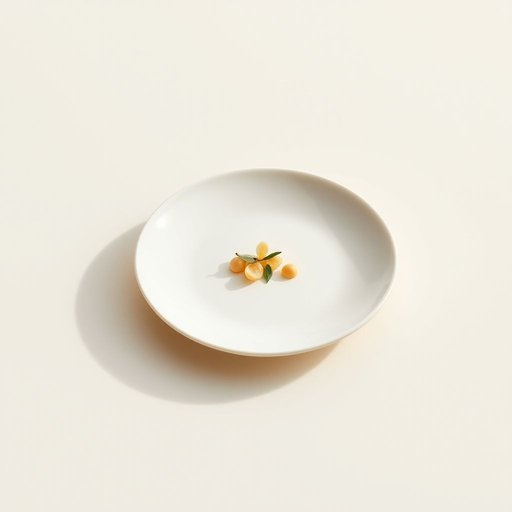

# dish

<h1 style="font-size: 2.5em; font-weight: 300; letter-spacing: 2px; margin: 0; color: #2c3e50;">
/dɪʃ/
</h1>

---

---

## 例句

The complexity of the dish prepared by the chef, combining multiple cuisines and intricate techniques, impressed the food critics who visited the restaurant expecting a simple meal.

*The(/ðə/) complexity(/kəmˈplɛksɪti/) of(/əv/) the(/ðə/) dish(/dɪʃ/) prepared(/priˈpɛrd/) by(/baɪ/) the(/ðə/) chef,(/ʃɛf,/) combining(/kəmˈbaɪnɪŋ/) multiple(/ˈməltəpəl/) cuisines(/kwɪˈzinz/) and(/ənd/) intricate(/ˈɪntrəkət/) techniques,(/tɛkˈniks,/) impressed(/ˌɪmˈprɛst/) the(/ðə/) food(/fud/) critics(/ˈkrɪtɪks/) who(/hu/) visited(/ˈvɪzɪtɪd/) the(/ðə/) restaurant(/ˈrɛˌstrɑnt/) expecting(/ɪkˈspɛktɪŋ/) a(/ə/) simple(/ˈsɪmpəl/) meal.(/mil./)*

**翻译：** 主厨所准备的菜肴复杂多样，融合了多种烹饪风格和精巧技艺，让原本期待简餐的美食评论家们深感惊艳。

---

## 解释

英语单词“dish”作为名词，在家居生活用品语境中主要指“盘子”或“碟子”，即用于盛放食物的器皿，通常是扁平或浅盘形状。具体使用场合包括日常餐桌上用来盛放饭菜、点心或水果等，如“a dinner dish”（晚餐盘）或“a serving dish”（盛菜盘）。此外，dish也可指“一道菜”或“菜肴”，但在家居用品语境中更侧重其物理形态。英语学习者需要注意，dish作为可数名词，其复数形式为dishes，且在搭配上常与动词“wash”（洗）、“set”（摆放）、“serve”（盛装）等连用，如“wash the dishes”（洗碗碟），“put the dishes on the table”（把盘子放到桌子上）。在表达技巧上，“dish out”作为动词短语有“分发食物”或“责备”的意思，但此用法仅限动词，不影响名词用法。词源方面，dish源自古英语“disc”，源自拉丁语“discus”，意指圆盘形物体，反映了该词最初指圆形盛食器皿的本义。中文语境中，dish作为名词应被准确翻译成“盘子”或“碟子”，避免误译为“饭菜”或“菜肴”，以免混淆具体物品与菜品本身。该词在家居用品语境下无褒贬色彩，属于中性词汇，日常生活中常见且实用，总体用法简单明确，适合英语初学者掌握。

---

<small style="color: #999; font-size: 0.9em;">2025-07-17 06:22:39</small>

