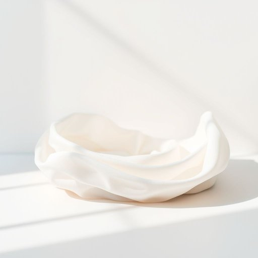

# dishcloth

<h1 style="font-size: 2.5em; font-weight: 300; letter-spacing: 2px; margin: 0; color: #2c3e50;">
/dishcloth*/
</h1>

---

---

## 例句

After washing up the dishes that had piled up over the weekend, she reached for a clean dishcloth, which, unlike the damp and slightly musty one she had been using earlier, was freshly laundered, soft to the touch, and crisply scented with lavender, making the mundane task of drying the plates, bowls, and cutlery a surprisingly pleasant part of her Saturday morning routine.

*After(/ˈæftər/) washing(/ˈwɑʃɪŋ/) up(/əp/) the(/ðə/) dishes(/ˈdɪʃɪz/) that(/ðət/) had(/hæd/) piled(/paɪld/) up(/əp/) over(/ˈoʊvər/) the(/ðə/) weekend,(/ˈwiˌkɪnd,/) she(/ʃi/) reached(/riʧt/) for(/fər/) a(/ə/) clean(/klin/) dishcloth,(/dishcloth*,/) which,(/wɪʧ,/) unlike(/ənˈlaɪk/) the(/ðə/) damp(/dæmp/) and(/ənd/) slightly(/sˈlaɪtli/) musty(/ˈməsti/) one(/wən/) she(/ʃi/) had(/hæd/) been(/bɪn/) using(/ˈjuzɪŋ/) earlier,(/ˈərliər,/) was(/wɑz/) freshly(/ˈfrɛʃli/) laundered,(/ˈlɔndərd,/) soft(/sɔft/) to(/tɪ/) the(/ðə/) touch,(/təʧ,/) and(/ənd/) crisply(/ˈkrɪspli/) scented(/ˈsɛntɪd/) with(/wɪθ/) lavender,(/ˈlævəndər,/) making(/ˈmeɪkɪŋ/) the(/ðə/) mundane(/mənˈdeɪn/) task(/tæsk/) of(/əv/) drying(/draɪɪŋ/) the(/ðə/) plates,(/pleɪts,/) bowls,(/boʊlz,/) and(/ənd/) cutlery(/ˈkətləri/) a(/ə/) surprisingly(/səˈpraɪzɪŋli/) pleasant(/ˈplɛzənt/) part(/pɑrt/) of(/əv/) her(/hər/) Saturday(/ˈsæˌtɪˌdeɪ/) morning(/ˈmɔrnɪŋ/) routine.(/ruˈtin./)*

**翻译：** 把周末堆积的碗碟洗干净后，她拿起一块干净的擦碟布。与之前用的那块潮湿、略带霉味的擦布不同，这块是刚洗过的，触感柔软，带着清新的薰衣草香味，使得擦干盘子、碗和餐具这项平凡的家务活，意外地成为她周六早晨例行中一段令人愉悦的时光。

---

## 解释

英语单词“dishcloth”作为名词，指的是厨房中用来擦洗或擦干餐具、锅碗瓢盆等器皿的布巾，常见于家居生活用品范畴，尤其是在餐后清洁或日常厨房维护时使用。“dishcloth”通常出现在厨房环境、家务活动相关的语境中，如“wipe the table with a dishcloth”（用抹布擦桌子）或“hang the dishcloth to dry”（晾干抹布）。英语学习者使用该词时应注意其构词结构为复合词，由“dish”（盘子）和“cloth”（布）组成，属于可数名词，复数形式通常为“dishcloths”，且常与动词“use”、“wash”、“hang”等搭配使用。此外，该词无特殊时态变化，语法使用较为直接。词源方面，“dishcloth”起源于英语中“dish”（源自古英语“disc”，意指盘子）与“cloth”（布）结合，描绘了其功能性，即用于清洁餐具的布制品，词汇形象明确。中文语境中，“dishcloth”准确翻译为“抹布”，是家庭厨房常用的清洁用布，没有褒贬含义，也不含特殊文化色彩，只是家居生活中极为普通和实用的工具名词，使用时无需过度复杂理解，掌握其基本用途和语法位置即可。

---

<small style="color: #999; font-size: 0.9em;">2025-07-17 06:22:39</small>

