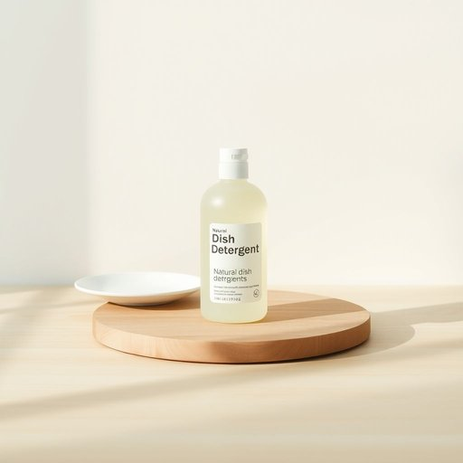

# dishdetergent

<h1 style="font-size: 2.5em; font-weight: 300; letter-spacing: 2px; margin: 0; color: #2c3e50;">
/dishdetergent*/
</h1>

---

---

## 例句

Could you please pick up some dishdetergent on your way home, preferably the one with natural ingredients that’s gentle on the skin, because the one we currently have, which leaves an unpleasant residue on the glasses and doesn't lather properly, is running out fast after washing all those pots and pans from last night’s dinner party?

*Could(/kʊd/) you(/ju/) please(/pliz/) pick(/pɪk/) up(/əp/) some(/səm/) dishdetergent(/dishdetergent*/) on(/ɔn/) your(/jʊr/) way(/weɪ/) home,(/hoʊm,/) preferably(/ˈprɛfərəbli/) the(/ðə/) one(/wən/) with(/wɪθ/) natural(/ˈnæʧərəl/) ingredients(/ˌɪnˈgridiənts/) that’s(/that’s*/) gentle(/ˈʤɛnəl/) on(/ɔn/) the(/ðə/) skin,(/skɪn,/) because(/bɪˈkəz/) the(/ðə/) one(/wən/) we(/wi/) currently(/ˈkərəntli/) have,(/hæv,/) which(/wɪʧ/) leaves(/livz/) an(/ən/) unpleasant(/ənˈplɛzənt/) residue(/ˈrɛzəˌdu/) on(/ɔn/) the(/ðə/) glasses(/ˈglæsɪz/) and(/ənd/) doesn't(/ˈdəzənt/) lather(/ˈlæðər/) properly,(/ˈprɑpərli,/) is(/ɪz/) running(/ˈrənɪŋ/) out(/aʊt/) fast(/fæst/) after(/ˈæftər/) washing(/ˈwɑʃɪŋ/) all(/ɔl/) those(/ðoʊz/) pots(/pɑts/) and(/ənd/) pans(/pænz/) from(/frəm/) last(/læst/) night’s(/night’s*/) dinner(/ˈdɪnər/) party?(/ˈpɑrti?/)*

**翻译：** 你回家的路上能顺便买点洗洁精吗？最好是那种成分天然、温和护肤的，因为我们现在用的洗洁精洗昨晚聚会后的锅碗瓢盆时，不仅很快就用完了，还会在玻璃杯上留下不舒服的残留，而且起泡也不好。

---

## 解释

“dish detergent”作为名词，在家居生活用品的语境中指用来清洗餐具、锅碗瓢盆等厨房用具的洗涤剂，通常以液体或凝胶形态出现，旨在去除油脂和食品残渣，常见于家庭厨房或餐厅洗碗区。英语学习者使用该词时要注意其复合名词结构，由“dish”（餐具）和“detergent”（洗涤剂）组合而成，通常无需复数形式“dish detergents”表示多种洗洁精产品，但在表达具体数量时可用复数。同时，“dish detergent”多常搭配搭配词有“liquid”，“powder”，“brand”等，如“liquid dish detergent”（液体洗洁精）、“dish detergent brand”（洗洁精品牌）；表达时要避免与“dish soap”混淆，后者虽常用，但在正式语境中“dish detergent”更为准确。词源方面，“detergent”源自拉丁语“detergere”，意为擦净、清除污垢，结合“dish”明确指向餐具清洁剂，反映了该词的功能定位。中文中“dish detergent”准确翻译为“洗洁精”或“洗碗液”，强调其专用于洗涤餐具的功能，区别于一般的洗衣液或清洁剂。该词在日常生活中无特殊褒贬色彩，属于中性词汇，广泛应用于家庭和商业厨房环境，无特殊文化内涵，但在不同地区，“dish detergent”与“dish soap”可能存在用词习惯差异，英语学习者应根据具体语境选择合适表达。

---

<small style="color: #999; font-size: 0.9em;">2025-07-17 06:22:39</small>

