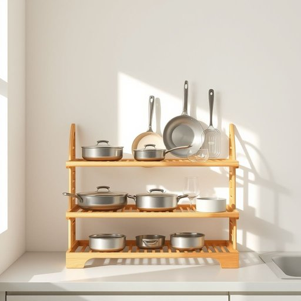

# dishrack

<h1 style="font-size: 2.5em; font-weight: 300; letter-spacing: 2px; margin: 0; color: #2c3e50;">
/dishrack*/
</h1>

---

---

## 例句

After the dishrack caught my attention during dinner preparation, I asked if its stability, despite being wobbly, affected the overall kitchen organization and efficiency in draining water from the pots, pans, and delicate glassware.

*After(/ˈæftər/) the(/ðə/) dishrack(/dishrack*/) caught(/kɔt/) my(/maɪ/) attention(/əˈtɛnʃən/) during(/ˈdʊrɪŋ/) dinner(/ˈdɪnər/) preparation,(/ˌprɛpərˈeɪʃən,/) I(/aɪ/) asked(/æst/) if(/ɪf/) its(/ɪts/) stability,(/stəˈbɪlɪti,/) despite(/dɪˈspaɪt/) being(/biɪŋ/) wobbly,(/ˈwɑbəli,/) affected(/əˈfɛktɪd/) the(/ðə/) overall(/ˈoʊvərˌɔl/) kitchen(/ˈkɪʧən/) organization(/ˌɔrgənəˈzeɪʃən/) and(/ənd/) efficiency(/ɪˈfɪʃənsi/) in(/ɪn/) draining(/ˈdreɪnɪŋ/) water(/ˈwɔtər/) from(/frəm/) the(/ðə/) pots,(/pɑts,/) pans,(/pænz,/) and(/ənd/) delicate(/ˈdɛləkət/) glassware.(/ˈglæsˌwɛr./)*

**翻译：** 在晚餐准备时，碗碟架引起了我的注意，我便询问即便它有些摇晃，其稳定性是否影响了整体厨房的整理，以及锅、平底锅和易碎玻璃器皿的排水效率。

---

## 解释

Dishrack作为名词，在家居生活用品语境中指一种用于放置洗净餐具杯碟等器皿以便自然风干或沥干水分的架子或托盘，具体使用场合通常是在厨房，即洗碗后将碗碟等餐具摆放在dishrack上方便水分流失保持餐具干燥整洁，英语学习者使用该词时需注意它通常是实物名词多为可数名词，常见搭配有plastic dishrack metal dishrack dishrack rack或与动作动词连用如put the dishes in the dishrack或leave the wet dishes on the dishrack，此外dishrack比较口语化有时也用dish drainer或drying rack替代，词源由dish（盘子餐具）和rack（架子支架）组成反映功能即用于放置餐具的架子，起源于厨房生活日用品实际需要语言直白实用，在中文语境中dishrack准确译为碗碟架或沥水架，指专门用于沥干餐具水分的家居小物件通常为塑料或金属材质无明显褒贬含义属中性词汇文化内涵主要体现现代厨房便利生活反映讲究卫生和效率的饮食生活习惯。

---

<small style="color: #999; font-size: 0.9em;">2025-07-17 06:22:39</small>

