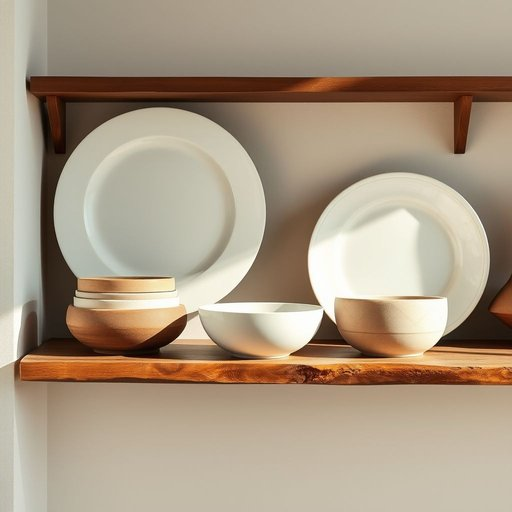

# dishware

<h1 style="font-size: 2.5em; font-weight: 300; letter-spacing: 2px; margin: 0; color: #2c3e50;">
/dishware*/
</h1>

---

---

## 例句

After unpacking the boxes from the move, the careful organisation of the dishware, which included delicate porcelain plates adorned with intricate patterns and sturdy stoneware bowls, transformed the kitchen shelves into a display that was both accessible for everyday use and complementary to the room’s rustic décor.

*After(/ˈæftər/) unpacking(/ənˈpækɪŋ/) the(/ðə/) boxes(/ˈbɑksɪz/) from(/frəm/) the(/ðə/) move,(/muv,/) the(/ðə/) careful(/ˈkɛrfəl/) organisation(/ˌɔrgənɪˈzeɪʃən/) of(/əv/) the(/ðə/) dishware,(/dishware*,/) which(/wɪʧ/) included(/ˌɪnˈkludɪd/) delicate(/ˈdɛləkət/) porcelain(/ˈpɔrsələn/) plates(/pleɪts/) adorned(/əˈdɔrnd/) with(/wɪθ/) intricate(/ˈɪntrəkət/) patterns(/ˈpætərnz/) and(/ənd/) sturdy(/ˈstərdi/) stoneware(/ˈstoʊnˌwɛr/) bowls,(/boʊlz,/) transformed(/trænsˈfɔrmd/) the(/ðə/) kitchen(/ˈkɪʧən/) shelves(/ʃɛlvz/) into(/ˈɪntu/) a(/ə/) display(/dɪˈspleɪ/) that(/ðət/) was(/wɑz/) both(/boʊθ/) accessible(/ækˈsɛsəbəl/) for(/fər/) everyday(/ˈɛvriˈdeɪ/) use(/juz/) and(/ənd/) complementary(/ˌkɑmpləˈmɛnʧi/) to(/tɪ/) the(/ðə/) room’s(/room’s*/) rustic(/ˈrəstɪk/) décor.(/décor*./)*

**翻译：** 搬家卸箱后，经过细心整理的餐具——包括饰有精美图案的精致瓷盘和结实耐用的陶瓷碗——使厨房的货架变成了一个既方便日常使用又与房间质朴风格相得益彰的陈列空间。

---

## 解释

英语单词“dishware”在家居生活用品场景中作为名词，指的是用于盛装和食用食物的各类餐具，主要包括盘子、碟子、碗等器皿，通常是陶瓷、玻璃或瓷器制成的，具体使用场合常见于描述厨房或餐厅的物品，如“setting the table with dishware”（用餐具摆桌子）或“washing the dishware”（洗餐具），强调的是餐具整体而非单个餐具，在语法上，“dishware”通常作为不可数名词使用，表示整体的餐具集合，但在特定语境下也可视为集合名词，英语学习者应注意其不可数特性，避免直接加复数形式“dishwares”，同时常见搭配有“set of dishware”（一套餐具）、“dishware collection”（餐具收藏）等，表达时可以用“a piece of dishware”（一件餐具）来指单个物品，词源上，“dishware”由“dish”（盘子、碟子）和“ware”（器皿、用具）组合而成，反映其涵盖多种餐具器皿的泛指意味，中文语境中，“dishware”准确翻译为“餐具”或“餐具器皿”，但需区别于“cutlery”（刀叉等餐具）和“cookware”（炊具、锅具），它专指用于盛食物的器皿部分，该词通常无特殊褒贬含义或文化色彩，属于中性词，常用于描述家居物品或厨房用品分类中，是生活化和实用性的词汇。

---

<small style="color: #999; font-size: 0.9em;">2025-07-17 06:22:39</small>

