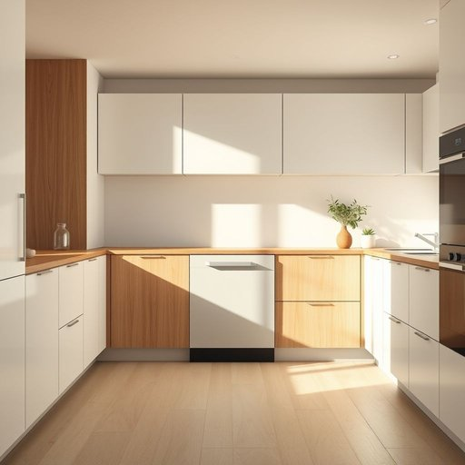

# dishwasher

<h1 style="font-size: 2.5em; font-weight: 300; letter-spacing: 2px; margin: 0; color: #2c3e50;">
/ˈdɪʃˌwɑʃər/
</h1>

---

---

## 例句

After a long day of cooking and entertaining guests, I was utterly relieved to find that the dishwasher, which we'd recently installed to save time and avoid the tedious chore of hand-washing, had efficiently cleaned every stubborn pot, pan, and plate stacked inside it, leaving the kitchen spotless and allowing me to relax with a cup of tea.

*After(/ˈæftər/) a(/ə/) long(/lɔŋ/) day(/deɪ/) of(/əv/) cooking(/ˈkʊkɪŋ/) and(/ənd/) entertaining(/ˌɛnərˈteɪnɪŋ/) guests,(/gɛsts,/) I(/aɪ/) was(/wɑz/) utterly(/ˈətərli/) relieved(/rɪˈlivd/) to(/tɪ/) find(/faɪnd/) that(/ðət/) the(/ðə/) dishwasher,(/ˈdɪʃˌwɑʃər,/) which(/wɪʧ/) we'd(/wid/) recently(/ˈrisəntli/) installed(/ˌɪnˈstɔld/) to(/tɪ/) save(/seɪv/) time(/taɪm/) and(/ənd/) avoid(/əˈvɔɪd/) the(/ðə/) tedious(/ˈtidiəs/) chore(/ʧɔr/) of(/əv/) hand-washing,(/hand-washing*,/) had(/hæd/) efficiently(/ɪˈfɪʃəntli/) cleaned(/klind/) every(/ˈɛvəri/) stubborn(/ˈstəbərn/) pot,(/pɑt,/) pan,(/pæn,/) and(/ənd/) plate(/pleɪt/) stacked(/stækt/) inside(/ˌɪnˈsaɪd/) it,(/ɪt,/) leaving(/ˈlivɪŋ/) the(/ðə/) kitchen(/ˈkɪʧən/) spotless(/ˈspɑtləs/) and(/ənd/) allowing(/əˈlaʊɪŋ/) me(/mi/) to(/tɪ/) relax(/rɪˈlæks/) with(/wɪθ/) a(/ə/) cup(/kəp/) of(/əv/) tea.(/ti./)*

**翻译：** 经过一天繁忙的烹饪和招待客人后，我感到无比轻松，因为我们最近安装的洗碗机高效清洗了所有顽固的锅、平底锅和碟子，厨房变得一尘不染，让我得以端着一杯茶放松身心。

---

## 解释

dishwasher作为名词，主要指家用或商用的洗碗机，是一种用于自动清洗餐具、炊具和餐盘的家居电器，通常安装在厨房中，在有大量餐具需要清洗的环境中使用，比如家庭厨房、餐馆或食堂。英语学习者在使用dishwasher时需要注意，该词为可数名词，复数形式为dishwashers，在句中通常作为主语或宾语出现，搭配动词时需根据主语单复数调整动词形式，常见的搭配有run the dishwasher（运行洗碗机）、load the dishwasher（装载洗碗机）、empty the dishwasher（清空洗碗机）等表达，此外，dishwasher也可指代洗碗机操作人员，但此用法较少且正式场合少见。该词由dish（盘子、碟子）和washer（洗涤机）组合而成，起源于19世纪末至20世纪初，随着家用电器的发展而普及，反映了生活现代化和劳动分工的趋势。在中文中，dishwasher准确翻译为洗碗机，这一词汇直观且普遍为大众所理解，不带有特殊的褒贬色彩，也无特殊文化内涵，属于中性词汇，主要用于日常生活或家电产品描述中，表达的是一种便捷、高效的厨房辅助工具。

---

<small style="color: #999; font-size: 0.9em;">2025-07-17 06:22:39</small>

