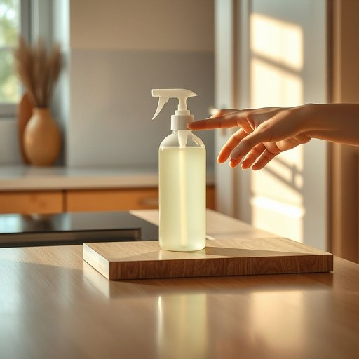

# disinfectant

<h1 style="font-size: 2.5em; font-weight: 300; letter-spacing: 2px; margin: 0; color: #2c3e50;">
/dɪsɪnˈfɛktənt/
</h1>

---

---

## 例句

Before the dinner party begins, the host carefully checks the disinfectant to ensure the kitchen surfaces and door handles are thoroughly sterilised, preventing the spread of germs among guests.

*Before(/ˌbiˈfɔr/) the(/ðə/) dinner(/ˈdɪnər/) party(/ˈpɑrti/) begins,(/bɪˈgɪnz,/) the(/ðə/) host(/hoʊst/) carefully(/ˈkɛrfəli/) checks(/ʧɛks/) the(/ðə/) disinfectant(/dɪsɪnˈfɛktənt/) to(/tɪ/) ensure(/ɪnˈʃʊr/) the(/ðə/) kitchen(/ˈkɪʧən/) surfaces(/ˈsərfəsɪz/) and(/ənd/) door(/dɔr/) handles(/ˈhændəlz/) are(/ər/) thoroughly(/ˈθəroʊli/) sterilised,(/sterilised*,/) preventing(/prɪˈvɛnɪŋ/) the(/ðə/) spread(/sprɛd/) of(/əv/) germs(/ʤərmz/) among(/əˈməŋ/) guests.(/gɛsts./)*

**翻译：** 晚宴开始前，主人仔细检查消毒剂，确保厨房台面和门把手被彻底消毒，从而防止细菌在宾客之间传播。

---

## 解释

“disinfectant”作为名词，指用于清洁和杀灭细菌、病毒等病原微生物的消毒剂，常见于家居生活用品领域，尤其在厨房、卫生间、医疗环境或公共空间中，用于保持环境卫生和预防传染病传播。英语学习者在使用该词时需注意其为可数名词，复数形式为“disinfectants”，常与动词“use”、“apply”、“spray”等搭配，如“use a disinfectant to clean surfaces”（用消毒剂清洁表面）；此外，该词一般用于指液体或喷剂类消毒产品。词源上，“disinfectant”来自拉丁语“dis-”表示否定或去除，“infect”源自“infectare”意为感染，合成词指去除感染源的物质，体现其功能属性。在中文语境中，“disinfectant”准确翻译为“消毒剂”或“消毒液”，强调其杀菌消毒的作用，属于中性词汇，无特殊褒贬或文化色彩，日常生活中多与卫生、安全及健康防护相关联，使用时应注意其功能与用途的正确区分，避免与“cleaner”（清洁剂）混淆，因为消毒剂强调杀灭微生物，而清洁剂则主要用于去除污垢。

---

<small style="color: #999; font-size: 0.9em;">2025-07-17 06:22:39</small>

