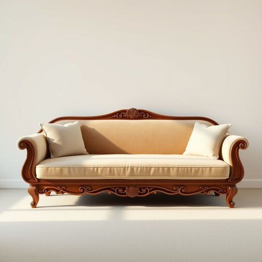

# divan

<h1 style="font-size: 2.5em; font-weight: 300; letter-spacing: 2px; margin: 0; color: #2c3e50;">
/dɪˈvæn/
</h1>

---

---

## 例句

After browsing several furniture stores online, I finally decided to purchase a vintage divan, which not only provides a comfortable seating option in the living room but also doubles as an elegant daybed, complete with intricate wooden carvings and plush upholstery that perfectly complement the rest of our Victorian-themed decor.

*After(/ˈæftər/) browsing(/ˈbraʊzɪŋ/) several(/ˈsɛvərəl/) furniture(/ˈfərnɪʧər/) stores(/stɔrz/) online,(/ˈɔnˌlaɪn,/) I(/aɪ/) finally(/ˈfaɪnəli/) decided(/ˌdɪˈsaɪdɪd/) to(/tɪ/) purchase(/ˈpərʧəs/) a(/ə/) vintage(/ˈvɪntɪʤ/) divan,(/dɪˈvæn,/) which(/wɪʧ/) not(/nɑt/) only(/ˈoʊnli/) provides(/prəˈvaɪdz/) a(/ə/) comfortable(/ˈkəmfərtəbəl/) seating(/ˈsitɪŋ/) option(/ˈɔpʃən/) in(/ɪn/) the(/ðə/) living(/ˈlɪvɪŋ/) room(/rum/) but(/bət/) also(/ˈɔlsoʊ/) doubles(/ˈdəbəlz/) as(/ɛz/) an(/ən/) elegant(/ˈɛləgənt/) daybed,(/daybed*,/) complete(/kəmˈplit/) with(/wɪθ/) intricate(/ˈɪntrəkət/) wooden(/ˈwʊdən/) carvings(/ˈkɑrvɪŋz/) and(/ənd/) plush(/pləʃ/) upholstery(/əˈpoʊlstəri/) that(/ðət/) perfectly(/ˈpərfəktli/) complement(/ˈkɑmpləmənt/) the(/ðə/) rest(/rɛst/) of(/əv/) our(/ɑr/) Victorian-themed(/victorian-themed*/) decor.(/ˈdeɪkɔr./)*

**翻译：** 在浏览了数家线上家具店后，我最终决定购买一张复古的长沙发，不仅为客厅提供了舒适的座椅选择，更兼具优雅的日床功能，其上精致的木雕与柔软的软垫完美呼应了我们维多利亚风格的整体装饰。

---

## 解释

英语单词“divan”作为名词在家居生活用品的语境中通常指一种无靠背或带低靠背的长而宽敞的沙发，起初源于中东和南亚地区，用作接待客人或休息的家具。具体使用场合多见于描述客厅或休息区的家具布置时，比如“The living room has a comfortable divan near the window”（客厅里靠窗有一张舒适的长沙发）。英语学习者在使用“divan”时需要注意它通常作为可数名词出现，复数形式为“divans”，且多搭配形容词描述其舒适性、款式或材质，如“leather divan”或“modern divan”，另外“divan bed”也是常见短语，指具有储物功能的床。词源上，“divan”一词源自波斯语“dīvān”，最初指政府的布告板或法庭，后来引申为带垫子的长椅，体现其历史上的文化背景和功能演变。在中文语境中，“divan”应准确理解为“缦椅”或“长榻”，一般指那种没有完整靠背但用于休息的长条形沙发，区别于常见的“沙发”或“长沙发”，但翻译时根据家具具体形态和文化习惯，也可译为“长沙发”或“睡榻”。需注意的是，“divan”在英语中虽无明显褒贬含义，但因其历史和地域色彩，使用时可能带有一种异域风情或复古雅致的审美意味，适合较正式或描写性文本，而非口语中最常用的“sofa”或“couch”。

---

<small style="color: #999; font-size: 0.9em;">2025-07-17 06:22:39</small>

