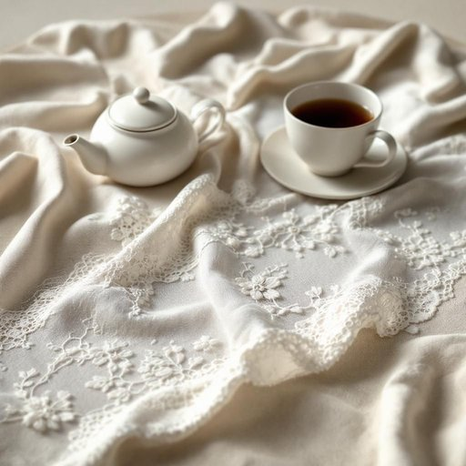

# doily

<h1 style="font-size: 2.5em; font-weight: 300; letter-spacing: 2px; margin: 0; color: #2c3e50;">
/ˈdɔɪli/
</h1>

---

---

## 例句

Could you please pass me the doily that Grandma crocheted last Christmas, the one with the intricate lace patterns which she always insists we place under the teapot and the vintage porcelain cups to protect the wooden table from any spills or heat marks during our afternoon tea?

*Could(/kʊd/) you(/ju/) please(/pliz/) pass(/pæs/) me(/mi/) the(/ðə/) doily(/ˈdɔɪli/) that(/ðət/) Grandma(/ˈgrændmɑ/) crocheted(/kroʊˈʃeɪd/) last(/læst/) Christmas,(/ˈkrɪsməs,/) the(/ðə/) one(/wən/) with(/wɪθ/) the(/ðə/) intricate(/ˈɪntrəkət/) lace(/leɪs/) patterns(/ˈpætərnz/) which(/wɪʧ/) she(/ʃi/) always(/ˈɔlˌweɪz/) insists(/ˌɪnˈsɪsts/) we(/wi/) place(/pleɪs/) under(/ˈəndər/) the(/ðə/) teapot(/ˈtiˌpɑt/) and(/ənd/) the(/ðə/) vintage(/ˈvɪntɪʤ/) porcelain(/ˈpɔrsələn/) cups(/kəps/) to(/tɪ/) protect(/prəˈtɛkt/) the(/ðə/) wooden(/ˈwʊdən/) table(/ˈteɪbəl/) from(/frəm/) any(/ˈɛni/) spills(/spɪlz/) or(/ər/) heat(/hit/) marks(/mɑrks/) during(/ˈdʊrɪŋ/) our(/ɑr/) afternoon(/ˌæftərˈnun/) tea?(/ti?/)*

**翻译：** 您能把奶奶去年圣诞节钩织的那个桌垫递给我吗？就是那个带有复杂花边图案的，她总坚持我们把它放在茶壶和复古瓷杯下面，以保护木桌免受下午茶时的溢漏或热痕。

---

## 解释

英语单词“doily”作为名词，主要指一种用于保护家具表面或装饰食物盘子的精致小块织物或纸巾，通常呈现镂空、蕾丝状或带有复杂花纹的圆形或椭圆形。它常见于家居生活用品中，使用场合多为餐桌布置、茶具摆放或家具装饰，目的是避免油渍、水印或划痕，同时增加美观。英语学习者在使用“doily”时需要注意其可数名词身份，通常用复数形式“doilies”表示多个，可与动词“place,” “put,” “use”连用，如“place a doily under the teapot”；此外，“doily”多做具体物品名词，不宜作抽象用法。该词源自17世纪的一位名为Doily的英国织布商，因其制作的布料精致小巧而得名，后泛指类似的装饰织物。中文语境中，“doily”准确翻译为“餐巾垫”或“茶几垫”，强调其小巧、精美和主要的防护与装饰功能。在文化层面，“doily”带有一定的复古和优雅色彩，常与传统英式下午茶或复古家居风格相关联，使用时不含贬义，但现代生活中较少见，使用可能显得有点正式或古典。

---

<small style="color: #999; font-size: 0.9em;">2025-07-17 06:22:39</small>

