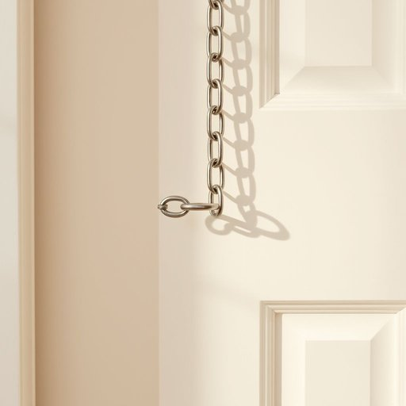

# door-chain

<h1 style="font-size: 2.5em; font-weight: 300; letter-spacing: 2px; margin: 0; color: #2c3e50;">
/door-chain*/
</h1>

---

---

## 例句

Although the old front door had been recently painted and fitted with a sturdy lock, my mum insisted on installing a new door-chain as an additional precaution, so that she could speak to unexpected visitors without fully unlocking the door, which made her feel considerably safer when living alone in the quiet neighbourhood.

*Although(/ˌɔlˈðoʊ/) the(/ðə/) old(/oʊld/) front(/frənt/) door(/dɔr/) had(/hæd/) been(/bɪn/) recently(/ˈrisəntli/) painted(/ˈpeɪnɪd/) and(/ənd/) fitted(/ˈfɪtɪd/) with(/wɪθ/) a(/ə/) sturdy(/ˈstərdi/) lock,(/lɑk,/) my(/maɪ/) mum(/məm/) insisted(/ˌɪnˈsɪstɪd/) on(/ɔn/) installing(/ˌɪnˈstɔlɪŋ/) a(/ə/) new(/nu/) door-chain(/door-chain*/) as(/ɛz/) an(/ən/) additional(/əˈdɪʃənəl/) precaution,(/priˈkɔʃən,/) so(/soʊ/) that(/ðət/) she(/ʃi/) could(/kʊd/) speak(/spik/) to(/tɪ/) unexpected(/ˌənɪkˈspɛktɪd/) visitors(/ˈvɪzɪtərz/) without(/wɪˈθaʊt/) fully(/ˈfʊli/) unlocking(/ənˈlɑkɪŋ/) the(/ðə/) door,(/dɔr,/) which(/wɪʧ/) made(/meɪd/) her(/hər/) feel(/fil/) considerably(/kənˈsɪdərəbli/) safer(/ˈseɪfər/) when(/wɪn/) living(/ˈlɪvɪŋ/) alone(/əˈloʊn/) in(/ɪn/) the(/ðə/) quiet(/kwaɪət/) neighbourhood.(/ˈneɪbərˌhʊd./)*

**翻译：** 虽然老前门最近刚刷了漆并装上了结实的锁，但妈妈坚持要安装一条新的门链，作为额外的防范措施，这样她可以在不完全开锁的情况下与意外来访者交谈，独自一人住在安静的街区时，这让她感到更加安心。

---

## 解释

door-chain作为名词，在家居生活用品场景中指的是安装在门上的一种安全装置，通常是一条短金属链条，一端固定在门框上，另一端通过挂钩固定在门上，开启门时链条限制了门的开启角度，从而防止陌生人或访客将门完全打开，以提高居家安全性。door-chain的具体使用场合多见于公寓、住宅或宾馆客房，尤其在需要部分开启门而保持安全的情境下使用，例如接待访客时能先用door-chain看清对方身份。英语学习者在使用door-chain时需注意它是可数名词，常见的搭配有“install a door-chain”（安装门链）、“use a door-chain”（使用门链）或“check the door-chain”（检查门链），表达时需注意“door-chain”作为复合名词整体使用，中间用连字符连接，避免拆分；另外，与安全相关时常用形容词如“secure door-chain”或“metal door-chain”搭配。door-chain一词起源于door（门）和chain（链条）的合成，源于简单的物理结构描述，其设计和使用历史较为悠久，最早作为防盗辅助装置而产生，体现了对居家隐私及安全的重视。在中文语境中，door-chain准确翻译为“门链”或“门锁链”，这是该物品的标准称谓，含义明确且通用，无明显褒贬或特殊文化色彩，但在使用时常被理解为安全门锁的一种简易形式，表达了家庭对安全防护的基本需求，通常无特殊感情色彩，仅作为实用器具存在。

---

<small style="color: #999; font-size: 0.9em;">2025-07-17 06:22:39</small>

