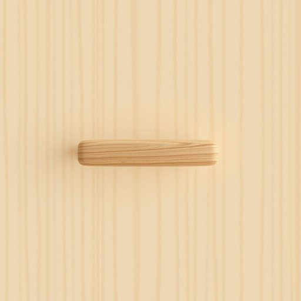

# door-handle

<h1 style="font-size: 2.5em; font-weight: 300; letter-spacing: 2px; margin: 0; color: #2c3e50;">
/door-handle*/
</h1>

---

---

## 例句

Could you please tighten the loose door-handle in the kitchen, which has been creaking every time we open the cupboard, before the guests arrive this evening and start wondering if we maintain the house properly?

*Could(/kʊd/) you(/ju/) please(/pliz/) tighten(/ˈtaɪtən/) the(/ðə/) loose(/lus/) door-handle(/door-handle*/) in(/ɪn/) the(/ðə/) kitchen,(/ˈkɪʧən,/) which(/wɪʧ/) has(/həz/) been(/bɪn/) creaking(/ˈkrikɪŋ/) every(/ˈɛvəri/) time(/taɪm/) we(/wi/) open(/ˈoʊpən/) the(/ðə/) cupboard,(/ˈkəbərd,/) before(/ˌbiˈfɔr/) the(/ðə/) guests(/gɛsts/) arrive(/əraɪv/) this(/ðɪs/) evening(/ˈivnɪŋ/) and(/ənd/) start(/stɑrt/) wondering(/ˈwəndərɪŋ/) if(/ɪf/) we(/wi/) maintain(/meɪnˈteɪn/) the(/ðə/) house(/haʊs/) properly?(/ˈprɑpərli?/)*

**翻译：** 请您在今晚客人到来之前，将厨房里那个打开橱柜时总吱吱作响的松动门把手拧紧，免得客人开始怀疑我们是否好好维护这所房子。

---

## 解释

“door-handle”作为名词，指的是门把手，即安装在门上用于开关门的机械装置，具体使用场合通常是指住宅、办公室、公共建筑等各种室内或室外的门上。在家居生活用品领域，这个词多出现在描述家具配置、装修细节或者购买门配件的语境中。英语学习者使用该词时需注意，“door-handle”通常以复合名词形式出现，中间用连字符连接，表示门上的把手，语法上作为单数名词使用，复数形式是“door-handles”。常见搭配包括“metal door-handle”（金属门把手）、“door-handle mechanism”（门把手机制）、“door-handle replacement”（更换门把手）等，使用时还应留意与动词搭配的准确性，如“turn the door-handle”（转动门把手）、“grab the door-handle”（抓住门把手）。词源方面，“door”源自古英语“duru”或“dor”，意为门；“handle”则来源中古英语“handlen”，意为用手操作的部分，两词合成表示门的手柄装置。中文语境中，“door-handle”一般翻译为“门把手”，强调它是门上供手握持用以开关门的部件，语义中性，无褒贬色彩，也无特殊文化隐含，只是日常生活中常见的家居五金配件。因此，理解和使用时应聚焦于其物理功能和家居环境中的具体应用，避免混淆为门锁、门钮或门闩等其他门部件。

---

<small style="color: #999; font-size: 0.9em;">2025-07-17 06:22:39</small>

