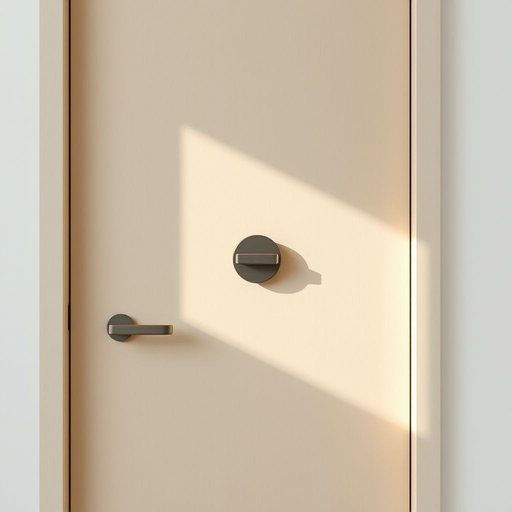

# door-lock

<h1 style="font-size: 2.5em; font-weight: 300; letter-spacing: 2px; margin: 0; color: #2c3e50;">
/door-lock*/
</h1>

---

---

## 例句

Before leaving the house, she double-checked that the door-lock, which had recently been installed to enhance security and prevent any accidental lockouts, was firmly engaged, ensuring peace of mind throughout the day.

*Before(/ˌbiˈfɔr/) leaving(/ˈlivɪŋ/) the(/ðə/) house,(/haʊs,/) she(/ʃi/) double-checked(/double-checked*/) that(/ðət/) the(/ðə/) door-lock,(/door-lock*,/) which(/wɪʧ/) had(/hæd/) recently(/ˈrisəntli/) been(/bɪn/) installed(/ˌɪnˈstɔld/) to(/tɪ/) enhance(/ɛnˈhæns/) security(/sɪˈkjʊrəti/) and(/ənd/) prevent(/prɪˈvɛnt/) any(/ˈɛni/) accidental(/ˌæksəˈdɛnəl/) lockouts,(/ˈlɑˌkaʊts,/) was(/wɑz/) firmly(/ˈfərmli/) engaged,(/ɪnˈgeɪʤd,/) ensuring(/ɪnˈʃʊrɪŋ/) peace(/pis/) of(/əv/) mind(/maɪnd/) throughout(/θruaʊt/) the(/ðə/) day.(/deɪ./)*

**翻译：** 离开房子前，她再次确认了那把最近为增强安全性、防止意外锁门而安装的门锁已牢固锁好，从而确保整日安心无忧。

---

## 解释

door-lock作为名词指的是安装在门上用于锁闭门扇以保障安全和隐私的装置常见于家庭办公室及其他建筑物的门上具体使用场合多为讨论家居安全门的安装维护或购买相关硬件时的描述如The door-lock is broken so we cannot secure the house门锁坏了所以我们无法保证房子的安全英语学习者在使用该词时需要注意door-lock通常是复合名词前半部分door作为修饰语限定后半部分lock整个词表示一个具体的实物语法上作可数名词使用复数形式为door-locks且常与动词如install安装replace更换repair修理等搭配常见表达技巧包括用形容词进一步说明如secure door-lock安全的门锁electronic door-lock电子门锁从词源角度看door-lock由door门和lock锁合成属于典型的英语合成词直观地说明了其功能和位置词源简洁明了无复杂历史背景在中文语境中door-lock准确翻译为门锁意指装在门上的锁具强调其作为家居安全用品的重要性该词无特殊的褒贬色彩或文化内涵主要是中性词汇只是普通家居生活中必备的安全设施使用时注意根据具体语境区分锁的类型和功能即可

---

<small style="color: #999; font-size: 0.9em;">2025-07-17 06:22:39</small>

