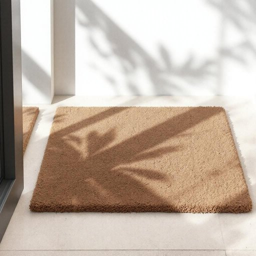

# door-mat

<h1 style="font-size: 2.5em; font-weight: 300; letter-spacing: 2px; margin: 0; color: #2c3e50;">
/door-mat*/
</h1>

---

---

## 例句

Before the guests arrived, the sight of the door-mat, which had endured countless storms and footfalls, stood as a silent testament to the passage of time and the subtle art of household maintenance.

*Before(/ˌbiˈfɔr/) the(/ðə/) guests(/gɛsts/) arrived,(/əraɪvd,/) the(/ðə/) sight(/saɪt/) of(/əv/) the(/ðə/) door-mat,(/door-mat*,/) which(/wɪʧ/) had(/hæd/) endured(/ɪnˈdʊrd/) countless(/ˈkaʊntləs/) storms(/stɔrmz/) and(/ənd/) footfalls,(/footfalls*,/) stood(/stʊd/) as(/ɛz/) a(/ə/) silent(/ˈsaɪlənt/) testament(/ˈtɛstəmənt/) to(/tɪ/) the(/ðə/) passage(/ˈpæsɪʤ/) of(/əv/) time(/taɪm/) and(/ənd/) the(/ðə/) subtle(/ˈsətəl/) art(/ɑrt/) of(/əv/) household(/ˈhaʊsˌhoʊld/) maintenance.(/ˈmeɪntənəns./)*

**翻译：** 在客人到来之前，那块经历了无数风雨和来往踩踏的门垫，静静地见证着时光的流逝与家务维护的细腻艺术。

---

## 解释

英语单词"door-mat"在家居生活用品场景中作为名词，指的是通常放置在门口用来擦拭鞋底泥土和污垢的小块地垫，主要用于保持室内清洁，常见于家庭、办公室等入口处。使用时多见于描述家居布置或清洁用品，如"wipe your feet on the door-mat"（在门垫上擦脚）。语法上，"door-mat"为可数名词，复数形式为"door-mats"；常见搭配包括"welcome door-mat"（欢迎门垫）、"rubber door-mat"（橡胶门垫）等，表达时注意其复合词结构，常用连字符连接，体现作为复合名词的整体含义。词源上，"door"意为门，"mat"意为垫，二者合成表示门口的垫子，起源于实用生活需求，早期英语中便有类似结构的合成词，用以具体说明放置位置和功能结合的物品。在中文语境中，"door-mat"准确翻译为“门垫”或“门口垫”，强调其物理功能和位置，词义明确且中性，无褒贬色彩。然而，在英语俚语或比喻用法中，"door-mat"也可用来形容某人性格软弱、容易被欺负，这一隐喻含义在中文日常生活中较少使用，学习者需根据语境区分实物与比喻义，避免混淆。

---

<small style="color: #999; font-size: 0.9em;">2025-07-17 06:22:39</small>

