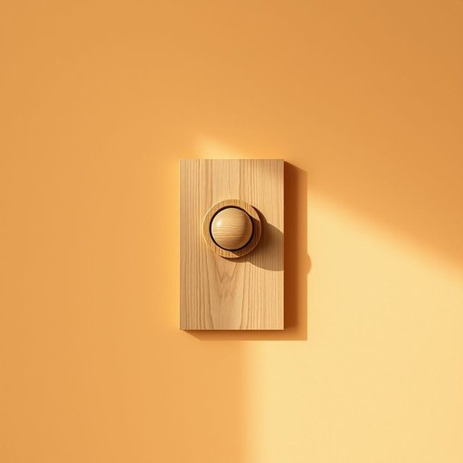

# doorbell

<h1 style="font-size: 2.5em; font-weight: 300; letter-spacing: 2px; margin: 0; color: #2c3e50;">
/ˈdɔrˌbɛl/
</h1>

---

---

## 例句

Whenever the doorbell, which had been silent for hours despite the usual afternoon visitors, finally rang sharply just as I was about to sit down with a cup of tea and my favourite novel, I felt a mixture of curiosity and mild apprehension about who could possibly be calling at such an unexpected hour.

*Whenever(/wɛˈnɛvər/) the(/ðə/) doorbell,(/ˈdɔrˌbɛl,/) which(/wɪʧ/) had(/hæd/) been(/bɪn/) silent(/ˈsaɪlənt/) for(/fər/) hours(/aʊərz/) despite(/dɪˈspaɪt/) the(/ðə/) usual(/ˈjuʒəwəl/) afternoon(/ˌæftərˈnun/) visitors,(/ˈvɪzɪtərz,/) finally(/ˈfaɪnəli/) rang(/ræŋ/) sharply(/ˈʃɑrpli/) just(/ʤɪst/) as(/ɛz/) I(/aɪ/) was(/wɑz/) about(/əˈbaʊt/) to(/tɪ/) sit(/sɪt/) down(/daʊn/) with(/wɪθ/) a(/ə/) cup(/kəp/) of(/əv/) tea(/ti/) and(/ənd/) my(/maɪ/) favourite(/ˈfeɪvərɪt/) novel,(/ˈnɑvəl,/) I(/aɪ/) felt(/fɛlt/) a(/ə/) mixture(/ˈmɪksʧər/) of(/əv/) curiosity(/ˌkjʊriˈɑsəti/) and(/ənd/) mild(/maɪld/) apprehension(/ˌæprɪˈhɛnʃən/) about(/əˈbaʊt/) who(/hu/) could(/kʊd/) possibly(/ˈpɑsəbli/) be(/bi/) calling(/ˈkɔlɪŋ/) at(/æt/) such(/səʧ/) an(/ən/) unexpected(/ˌənɪkˈspɛktɪd/) hour.(/aʊər./)*

**翻译：** 门铃响了，尽管下午时分通常有访客，但它几小时来一直沉寂无声。就在我正准备端着一杯茶，坐下来读我最喜欢的小说时，门铃突然尖锐地响起，我心中涌起好奇与淡淡的忧虑，不禁猜想着，在这样一个意想不到的时刻，究竟会是谁来访。

---

## 解释

“doorbell”作为名词，指的是安装在门口用于提醒屋内人员有人来访的铃铛或铃声装置，常见于居民住宅、办公室等场合。当有人按下门口的按钮时，doorbell会发出声音，提醒屋内的人开门或注意访客。英语学习者在使用“doorbell”时需要注意，它是一个复合名词，通常作为单数使用，但在表达多套房屋或多台装置时可用复数形式“doorbells”。常见搭配包括“ring the doorbell”（按门铃）、“doorbell sound”（门铃声音）、“doorbell chime”（门铃铃声）等，表达时多用固定结构表示动作或声音。语法上，“doorbell”作为可数名词，与冠词、形容词等搭配时遵循普通名词规则。词源上，“doorbell”由“door”（门）和“bell”（铃）合成，描绘其功能，即门上的铃声装置，起源于工业革命后期家庭生活设施的改进。中文中，“doorbell”准确翻译为“门铃”，在家居生活用品范畴中理解为提醒访客到来的一种便利设施，无褒贬或特殊文化色彩，仅具功能性描述，属于现代居家常见的基础设备。

---

<small style="color: #999; font-size: 0.9em;">2025-07-17 06:22:39</small>

