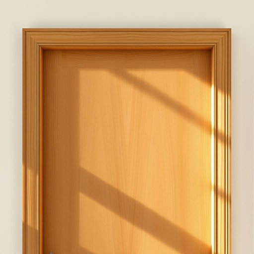

# doorframe

<h1 style="font-size: 2.5em; font-weight: 300; letter-spacing: 2px; margin: 0; color: #2c3e50;">
/doorframe*/
</h1>

---

---

## 例句

Before you start painting the living room, ensure the precise application of tape along the edges around the doorframe to prevent any accidental seepage of paint onto the woodwork, as this could result in a challenging cleanup process and potentially compromise the integrity and aesthetic of the entire wall finish.

*Before(/ˌbiˈfɔr/) you(/ju/) start(/stɑrt/) painting(/ˈpeɪnɪŋ/) the(/ðə/) living(/ˈlɪvɪŋ/) room,(/rum,/) ensure(/ɪnˈʃʊr/) the(/ðə/) precise(/prɪˈsaɪs/) application(/ˌæpləˈkeɪʃən/) of(/əv/) tape(/teɪp/) along(/əˈlɔŋ/) the(/ðə/) edges(/ˈɛʤɪz/) around(/əraʊnd/) the(/ðə/) doorframe(/doorframe*/) to(/tɪ/) prevent(/prɪˈvɛnt/) any(/ˈɛni/) accidental(/ˌæksəˈdɛnəl/) seepage(/ˈsipɪʤ/) of(/əv/) paint(/peɪnt/) onto(/ˈɔntu/) the(/ðə/) woodwork,(/ˈwʊdˌwərk,/) as(/ɛz/) this(/ðɪs/) could(/kʊd/) result(/rɪˈzəlt/) in(/ɪn/) a(/ə/) challenging(/ˈʧælənʤɪŋ/) cleanup(/ˈkliˌnəp/) process(/ˈprɔˌsɛs/) and(/ənd/) potentially(/pəˈtɛnʃəli/) compromise(/ˈkɑmprəˌmaɪz/) the(/ðə/) integrity(/ˌɪnˈtɛgrəti/) and(/ənd/) aesthetic(/ɛsˈθɛtɪk/) of(/əv/) the(/ðə/) entire(/ɪnˈtaɪər/) wall(/wɔl/) finish.(/ˈfɪnɪʃ./)*

**翻译：** 在开始为客厅刷漆之前，请务必沿着门框边缘精确贴好胶带，以防止油漆意外渗入木质装饰部分，否则不仅清理困难，还可能损害整个墙面饰面的完整性与美观。

---

## 解释

doorframe作为名词，在家居生活用品的语境中指的是门框，即支撑和包围门扇的结构部分，通常由木材、金属或其他材料制成，用以固定门的位置并确保门的正常开关。具体使用场合多见于装修、建筑、家具安装或维修描述中，如安装doorframe、测量doorframe的尺寸等。英语学习者在使用此词时应注意它是可数名词，通常与形容词连用，如wooden doorframe（木质门框）、metal doorframe（金属门框），而且常见搭配还有doorframe dimensions（门框尺寸）、doorframe repair（门框修理）。此外，doorframe的构成词由door（门）与frame（框架）组成，属于合成词，形象地表达了其功能和位置。词源上，door源自古英语duru，意为门，frame源于古英语framian，意为构造或形成，二者合成为doorframe一词。对应中文语境中可准确翻译为门框，含义明确，没有特殊褒贬色彩或者文化内涵，属于中性常用词汇，侧重描述物理空间中门的结构组成部分，帮助学习者理解和运用时主要注意其作为建筑和家居领域专用名词的准确含义和用法。

---

<small style="color: #999; font-size: 0.9em;">2025-07-17 06:22:39</small>

