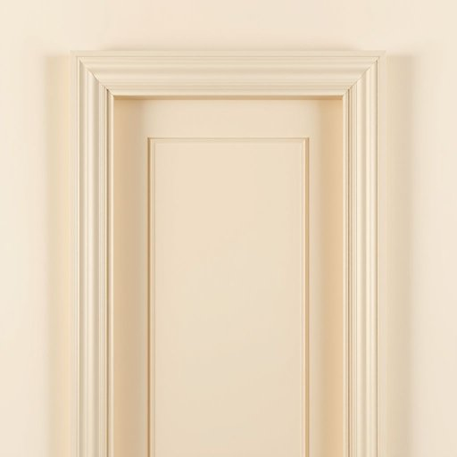

# doorjamb

<h1 style="font-size: 2.5em; font-weight: 300; letter-spacing: 2px; margin: 0; color: #2c3e50;">
/doorjamb*/
</h1>

---

---

## 例句

When I was repainting the hallway yesterday, I accidentally chipped the fresh paint off the doorjamb, which was particularly frustrating because the intricate moulding around it had taken ages to restore, and now I’ll have to touch it up again before the guests arrive this weekend.

*When(/wɪn/) I(/aɪ/) was(/wɑz/) repainting(/riˈpeɪntɪŋ/) the(/ðə/) hallway(/ˈhɔlˌweɪ/) yesterday,(/ˈjɛstərˌdeɪ,/) I(/aɪ/) accidentally(/ˌæksəˈdɛnəli/) chipped(/ʧɪpt/) the(/ðə/) fresh(/frɛʃ/) paint(/peɪnt/) off(/ɔf/) the(/ðə/) doorjamb,(/doorjamb*,/) which(/wɪʧ/) was(/wɑz/) particularly(/ˌpɑrˈtɪkjələrli/) frustrating(/ˈfrəˌstreɪtɪŋ/) because(/bɪˈkəz/) the(/ðə/) intricate(/ˈɪntrəkət/) moulding(/ˈmoʊldɪŋ/) around(/əraʊnd/) it(/ɪt/) had(/hæd/) taken(/ˈteɪkən/) ages(/ˈeɪʤɪz/) to(/tɪ/) restore,(/rɪˈstɔr,/) and(/ənd/) now(/naʊ/) I’ll(/i’ll*/) have(/hæv/) to(/tɪ/) touch(/təʧ/) it(/ɪt/) up(/əp/) again(/əˈgɛn/) before(/ˌbiˈfɔr/) the(/ðə/) guests(/gɛsts/) arrive(/əraɪv/) this(/ðɪs/) weekend.(/ˈwiˌkɪnd./)*

**翻译：** 昨天我在重新粉刷走廊时，不小心把门框上刚涂好的油漆磕掉了，这让我特别懊恼，因为门框周围那精致的雕花修复花了很长时间，而现在我得在客人周末到来之前再次补漆。

---

## 解释

doorjamb作为名词，指的是门框侧边的竖直部件，即门洞两侧的垂直结构部分，通常用于支撑和固定门扇，在家居生活用品领域中，doorjamb主要出现在讨论门结构、装修或维修门窗时。具体使用场合包括描述门的安装、门锁或门铰链的位置、测量门尺寸以及房屋建筑结构时。英语学习者使用doorjamb时需注意它是一个具体名词，通常作为可数名词使用，复数形式为doorjambs，且常与表示动作或状态的动词搭配，如install the doorjamb（安装门框）、paint the doorjamb（粉刷门框）、或measure the doorjamb（测量门框宽度）。此外，doorjamb常与相关词汇搭配，如doorjamb molding（门框装饰条）、doorjamb width（门框宽度）、doorjamb strike plate（门框的击板）等，学习者应注意这些搭配以便更准确描述门框相关内容。词源上，doorjamb由door（门）和jamb组成，其中jamb来源于法语jambe意为腿，引申为门窗的竖直支撑部分，体现其承载和支撑的功能，这一构词反映了建筑术语中常用人体部位比喻结构部件的习惯。在中文语境中，doorjamb准确翻译为门框（侧柱）、门框柱或门边框，强调其作为门洞两侧竖直结构的定位，区别于门扇（door leaf/door panel）和门槛（door sill）。该词没有特殊的褒贬含义或显著的文化色彩，属于实用且技术性的家居建筑词汇，使用时注意其具体位置和功能指代，有助于准确表达门的结构部分。

---

<small style="color: #999; font-size: 0.9em;">2025-07-17 06:22:39</small>

