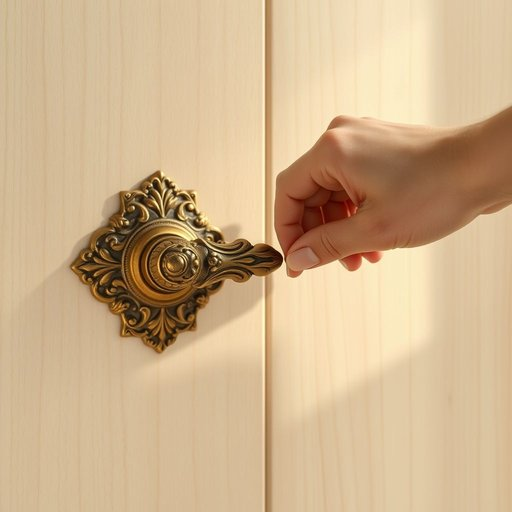

# doorknob

<h1 style="font-size: 2.5em; font-weight: 300; letter-spacing: 2px; margin: 0; color: #2c3e50;">
/ˈdurnɑb/
</h1>

---

---

## 例句

When I noticed that the antique doorknob, which had been handed down through generations and featured intricate brass detailing, was loose and wobbly, I decided to carefully tighten the screws while ensuring not to damage the delicate woodwork surrounding the door.

*When(/wɪn/) I(/aɪ/) noticed(/ˈnoʊtɪst/) that(/ðət/) the(/ðə/) antique(/ænˈtik/) doorknob,(/ˈdurnɑb,/) which(/wɪʧ/) had(/hæd/) been(/bɪn/) handed(/ˈhændɪd/) down(/daʊn/) through(/θru/) generations(/ˌʤɛnərˈeɪʃənz/) and(/ənd/) featured(/ˈfiʧərd/) intricate(/ˈɪntrəkət/) brass(/bræs/) detailing,(/dɪˈteɪlɪŋ,/) was(/wɑz/) loose(/lus/) and(/ənd/) wobbly,(/ˈwɑbəli,/) I(/aɪ/) decided(/ˌdɪˈsaɪdɪd/) to(/tɪ/) carefully(/ˈkɛrfəli/) tighten(/ˈtaɪtən/) the(/ðə/) screws(/skruz/) while(/waɪl/) ensuring(/ɪnˈʃʊrɪŋ/) not(/nɑt/) to(/tɪ/) damage(/ˈdæmɪʤ/) the(/ðə/) delicate(/ˈdɛləkət/) woodwork(/ˈwʊdˌwərk/) surrounding(/sərˈaʊndɪŋ/) the(/ðə/) door.(/dɔr./)*

**翻译：** 当我注意到那只传承数代、饰有精致黄铜花纹的古董门把手松动且摇晃时，我决定小心翼翼地拧紧螺丝，同时确保不损伤门周围细腻的木工雕饰。

---

## 解释

“doorknob”作为名词，指的是门把手中那种通常为圆形、用手旋转或按压以开启门的装置，常见于家庭、办公室等各种室内门的使用场合。在家居生活用品的语境中，doorknob是门与人交互的重要部分，通常安装在门的中间高度位置，便于用手抓握。英语学习者在使用doorknob时需注意其为可数名词，单复数形式分别为doorknob和doorknobs，常用搭配有“turn the doorknob”（转动门把手）、“grab the doorknob”（抓住门把手）等，此外需区分与“door handle”的区别，后者有时指更广泛的门把手形状，不一定是圆形旋钮。词源上，doorknob由“door”（门）和“knob”（指圆形小球或突起物）组成，knob源自中古英语，原意为小球或突起，随着时间演变，特指门上的旋转把手。中文中，“doorknob”准确翻译为“门把手”或“旋转门把手”，这是最常见和恰当的对应词，没有明显褒贬色彩，只是日常生活中的实用名词。总之，doorknob在英语中是描述门开闭机械部件的一般术语，使用时需结合上下文选择正确搭配，避免与其他门把手形式混淆，理解其构成和功能利于准确表达和理解。

---

<small style="color: #999; font-size: 0.9em;">2025-07-17 06:22:39</small>

