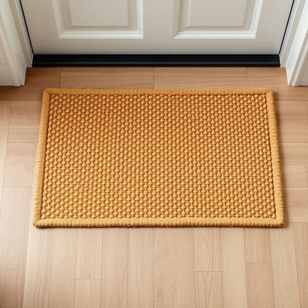

# doormat

<h1 style="font-size: 2.5em; font-weight: 300; letter-spacing: 2px; margin: 0; color: #2c3e50;">
/ˈdɔrˌmæt/
</h1>

---

---

## 例句

Before entering the house, please make sure to wipe your shoes thoroughly on the doormat, which not only helps keep the hallway clean but, given the rainy weather we've been having, prevents mud from being tracked all over the polished wooden floor.

*Before(/ˌbiˈfɔr/) entering(/ˈɛnərɪŋ/) the(/ðə/) house,(/haʊs,/) please(/pliz/) make(/meɪk/) sure(/ʃʊr/) to(/tɪ/) wipe(/waɪp/) your(/jʊr/) shoes(/ʃuz/) thoroughly(/ˈθəroʊli/) on(/ɔn/) the(/ðə/) doormat,(/ˈdɔrˌmæt,/) which(/wɪʧ/) not(/nɑt/) only(/ˈoʊnli/) helps(/hɛlps/) keep(/kip/) the(/ðə/) hallway(/ˈhɔlˌweɪ/) clean(/klin/) but,(/bət,/) given(/ˈgɪvɪn/) the(/ðə/) rainy(/ˈreɪni/) weather(/ˈwɛðər/) we've(/wiv/) been(/bɪn/) having,(/ˈhævɪŋ,/) prevents(/prɪˈvɛnts/) mud(/məd/) from(/frəm/) being(/biɪŋ/) tracked(/trækt/) all(/ɔl/) over(/ˈoʊvər/) the(/ðə/) polished(/ˈpɑlɪʃt/) wooden(/ˈwʊdən/) floor.(/flɔr./)*

**翻译：** 进入屋内前，请务必在门垫上彻底擦拭鞋底，这不仅有助于保持走廊的整洁，且鉴于近期多雨的天气，也能有效防止泥土被带进光洁的木地板上。

---

## 解释

英语单词“doormat”作为名词在家居生活用品语境中指的是放置在门口用来擦鞋底、保持室内清洁的地垫，通常由坚固耐用的材料制成，常见于家庭、办公室或商铺门前。在具体使用场合上，doormat常见于描述入口处的实物，如“Please wipe your feet on the doormat before entering”（请进门前在门垫上擦脚），其功能性和位置属性明确。英语学习者在使用该词时应注意doormat为可数名词，复数形式为doormats，搭配常见词汇有“welcome doormat”（欢迎门垫）、“rubber doormat”（橡胶门垫）、“front door doormat”（前门门垫）等，且常与动词“wipe（擦拭）、place（放置）、buy（购买）”等连用。此外，doormat在口语或隐喻用法中有贬义，指性格软弱、容易被人欺负或利用的人，故使用环境与语气需留意，避免混淆其字面义和引申义。词源方面，doormat由“door（门）”与“mat（垫）”组合而成，起源于中世纪英语，强调门前垫子在家居环境的重要性。在中文语境中，“doormat”通常准确翻译为“门垫”或“门口地垫”，明确指出其功能和位置，无特殊隐喻时为中性词。需要特别说明的是，在日常交流中若使用doormat形容人，中文对应的负面含义包括“任人欺负的人”或“软弱可欺的人”，这在文化理解上具备一定的贬义色彩，应根据语境斟酌使用。

---

<small style="color: #999; font-size: 0.9em;">2025-07-17 06:22:39</small>

