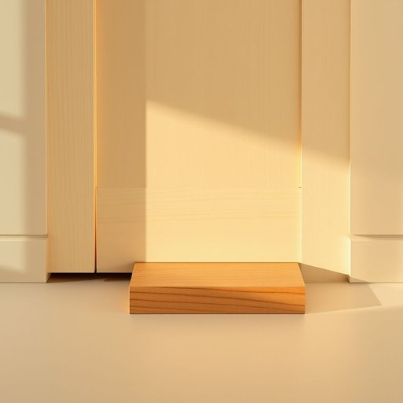

# doorstop

<h1 style="font-size: 2.5em; font-weight: 300; letter-spacing: 2px; margin: 0; color: #2c3e50;">
/doorstop*/
</h1>

---

---

## 例句

Could you please move the heavy wooden doorstop that’s been wedged under the kitchen door all afternoon, especially since it’s not only preventing the warm air from circulating properly but also causing the hinges to creak loudly every time someone walks by?

*Could(/kʊd/) you(/ju/) please(/pliz/) move(/muv/) the(/ðə/) heavy(/ˈhɛvi/) wooden(/ˈwʊdən/) doorstop(/doorstop*/) that’s(/that’s*/) been(/bɪn/) wedged(/wɛʤd/) under(/ˈəndər/) the(/ðə/) kitchen(/ˈkɪʧən/) door(/dɔr/) all(/ɔl/) afternoon,(/ˌæftərˈnun,/) especially(/əˈspɛʃəli/) since(/sɪns/) it’s(/it’s*/) not(/nɑt/) only(/ˈoʊnli/) preventing(/prɪˈvɛnɪŋ/) the(/ðə/) warm(/wɔrm/) air(/ɛr/) from(/frəm/) circulating(/ˈsərkjəˌleɪtɪŋ/) properly(/ˈprɑpərli/) but(/bət/) also(/ˈɔlsoʊ/) causing(/ˈkɔzɪŋ/) the(/ðə/) hinges(/ˈhɪnʤɪz/) to(/tɪ/) creak(/krik/) loudly(/ˈlaʊdli/) every(/ˈɛvəri/) time(/taɪm/) someone(/ˈsəmˌwən/) walks(/wɔks/) by?(/baɪ?/)*

**翻译：** 您能否将那个整下午一直楔在厨房门下的沉重木制门挡移开？不仅因为它阻碍了暖气的正常流通，还导致每当有人经过时门铰链都会发出刺耳的吱吱声。

---

## 解释

英文单词“doorstop”作为名词，主要指用于防止门关闭或移动的物品，即“门挡”或“门止”。在家居生活用品的语境中，doorstop通常放置在门下方或侧边，以固定门的位置，避免门被风吹关或碰撞损坏，常见于家中房间、办公室或商店的门口。英语学习者使用doorstop时需注意其主要用作可数名词，复数形式为doorstops，常见的搭配有“use a doorstop”（使用门挡）、“a rubber/wooden/metal doorstop”（橡胶/木制/金属门挡）等，此外，还可作比喻用法，如“a doorstop book”，指特别厚重的大部头书，用来压住门或桌子。doorstop一词源自中世纪英语，组合自“door”(门)和“stop”(阻止、止住)，反映了其物理功能。中文中doorstop准确翻译为“门挡”或“门止”，在家居环境里是一个中性词汇，没有褒贬含义，也无特殊文化色彩，仅表示实用的家居辅助用品，需注意不要与“doorstopper”混淆，后者有时泛指所有门挡物件或阻止门关闭的工具。总之，doorstop是一个具体且实用的名词，语言环境中常见且易于掌握，理解其功能和搭配有助于英语学习者准确运用及理解相关日常交流。

---

<small style="color: #999; font-size: 0.9em;">2025-07-17 06:22:39</small>

