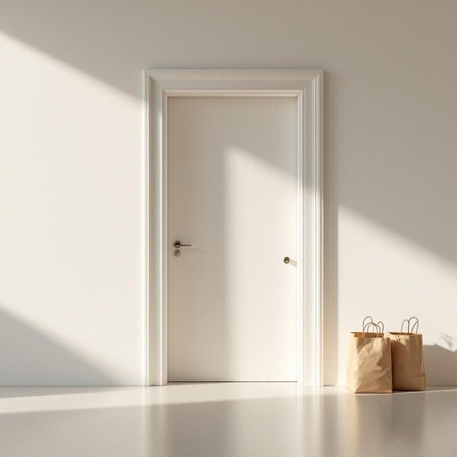

# doorway

<h1 style="font-size: 2.5em; font-weight: 300; letter-spacing: 2px; margin: 0; color: #2c3e50;">
/ˈdɔrˌweɪ/
</h1>

---

---

## 例句

Whenever I come home carrying groceries, I always make sure to place the bags carefully to one side of the doorway, where they won’t obstruct anyone’s path or risk being knocked over by the draft from the open windows.

*Whenever(/wɛˈnɛvər/) I(/aɪ/) come(/kəm/) home(/hoʊm/) carrying(/ˈkɛriɪŋ/) groceries,(/ˈgroʊsəriz,/) I(/aɪ/) always(/ˈɔlˌweɪz/) make(/meɪk/) sure(/ʃʊr/) to(/tɪ/) place(/pleɪs/) the(/ðə/) bags(/bægz/) carefully(/ˈkɛrfəli/) to(/tɪ/) one(/wən/) side(/saɪd/) of(/əv/) the(/ðə/) doorway,(/ˈdɔrˌweɪ,/) where(/wɛr/) they(/ðeɪ/) won’t(/won’t*/) obstruct(/əbˈstrəkt/) anyone’s(/anyone’s*/) path(/pæθ/) or(/ər/) risk(/rɪsk/) being(/biɪŋ/) knocked(/nɑkt/) over(/ˈoʊvər/) by(/baɪ/) the(/ðə/) draft(/dræft/) from(/frəm/) the(/ðə/) open(/ˈoʊpən/) windows.(/ˈwɪndoʊz./)*

**翻译：** 每当我拎着购物袋回家时，总会小心地把袋子放在门口一侧，以免妨碍他人通行或被开着的窗户吹来的风吹倒。

---

## 解释

“doorway”作为英语中的名词，主要指房屋或建筑物中门框与门之间的开口部分，即门洞，是连接室内外或不同房间的通道口。在家居生活用品的语境中，通常用来描述门的位置、安装门或与门相关的配件，如门框装饰、门槛等。使用时，doorway往往出现在话题涉及空间布局、出入通道或安全方面，例如“Please stand in the doorway”（请站在门口）。 “doorway”作为可数名词，其复数形式为“doorways”，且在语法上通常用作具体名词，在句中充当主语、宾语或介词宾语，需注意区分其与“door”（门）之间的区别，door指门本身，而doorway指门的位置或开口。此外，“doorway”可与介词短语搭配，如“in the doorway”（在门口）、“through the doorway”（穿过门口）等，表达方位和动作路径。在词源上，“doorway”源自古英语“duru”（门）与“way”（通路、道路）的结合，字面意思即为“门的通道”，体现了出入的功能特征。在中文语境中，通常翻译为“门口”、“门洞”或“门框”，而非仅指门本身，这有助于理解其强调的位置和结构含义。该词在用法上中性，不带褒贬或特殊文化色彩，更多用于空间描述和指示，是学习者在描述家庭、建筑结构及其出入口位置时常用且实用的词汇。

---

<small style="color: #999; font-size: 0.9em;">2025-07-17 06:22:39</small>

