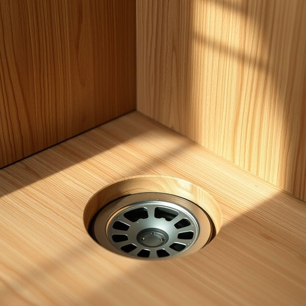

# drain

<h1 style="font-size: 2.5em; font-weight: 300; letter-spacing: 2px; margin: 0; color: #2c3e50;">
/dreɪn/
</h1>

---

---

## 例句

I had to call a plumber last weekend because the kitchen sink’s drain, which had been clogged with a stubborn mixture of grease and food scraps despite my regular cleaning efforts, started to emit an unpleasant odour and drain the water extremely slowly, causing water to pool around the base of the cabinet.

*I(/aɪ/) had(/hæd/) to(/tɪ/) call(/kɔl/) a(/ə/) plumber(/ˈpləmər/) last(/læst/) weekend(/ˈwiˌkɪnd/) because(/bɪˈkəz/) the(/ðə/) kitchen(/ˈkɪʧən/) sink’s(/sink’s*/) drain,(/dreɪn,/) which(/wɪʧ/) had(/hæd/) been(/bɪn/) clogged(/klɔgd/) with(/wɪθ/) a(/ə/) stubborn(/ˈstəbərn/) mixture(/ˈmɪksʧər/) of(/əv/) grease(/gris/) and(/ənd/) food(/fud/) scraps(/skræps/) despite(/dɪˈspaɪt/) my(/maɪ/) regular(/ˈrɛgjələr/) cleaning(/ˈklinɪŋ/) efforts,(/ˈɛfərts,/) started(/ˈstɑrtɪd/) to(/tɪ/) emit(/ɪˈmɪt/) an(/ən/) unpleasant(/ənˈplɛzənt/) odour(/ˈoʊdər/) and(/ənd/) drain(/dreɪn/) the(/ðə/) water(/ˈwɔtər/) extremely(/ɪkˈstrimli/) slowly,(/sˈloʊli,/) causing(/ˈkɔzɪŋ/) water(/ˈwɔtər/) to(/tɪ/) pool(/pul/) around(/əraʊnd/) the(/ðə/) base(/beɪs/) of(/əv/) the(/ðə/) cabinet.(/ˈkæbənət./)*

**翻译：** 上周末我不得不叫了个水管工，因为厨房水槽的排水管堵塞了，尽管我经常清理，但顽固的油脂和食物残渣混合物依然阻塞其中，导致排水非常缓慢，散发出难闻的气味，水还在柜子底部积聚成滩。

---

## 解释

在家居生活用品语境中，英语单词“drain”作为名词，通常指排水口、下水道、排水管或排水系统，用于描述水或液体流出的通道或装置，例如厨房水槽的排水口、浴室地漏等。具体使用场合多出现在描述厨房、卫生间及户外排水设施时，如“The kitchen sink drain is clogged”（厨房水槽的排水口堵塞了）。英语学习者使用该词作为名词时需注意其不可数和可数用法：通常表示具体的排水口时可数，指排水系统时常不可数；常见搭配包括“drain pipe”（排水管）、“drain cover”（排水口盖）、“blocked drain”（堵塞的排水口）等，表达时应注意与动词搭配，如“clear the drain”（清理排水口）。语法上，作为名词时可与冠词连用，作主语、宾语或表语，学习者应留意其与动词“drain”（动词，意为排水、耗尽）区分。词源上，“drain”来源于中古英语“drainen”，进一步追溯到古法语“drainer”，起源于拉丁语“drainare”，意指排出液体，体现其排水功能的本质。中文语境中，“drain”准确翻译为“排水口”、“下水道”或“排水管”，重点在于其作为水流出入口的物理结构，避免与动词意义混淆。该词在家居生活中属中性用语，无褒贬含义，也无特殊文化色彩，属于日常常用的基础生活设施词汇，正确理解和使用有助于提高描述家庭管道和排水系统的准确性和地道性。

---

<small style="color: #999; font-size: 0.9em;">2025-07-17 06:22:39</small>

