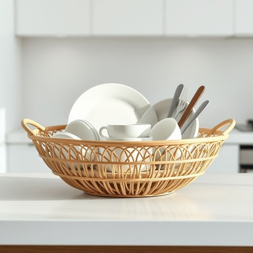

# drainer

<h1 style="font-size: 2.5em; font-weight: 300; letter-spacing: 2px; margin: 0; color: #2c3e50;">
/ˈdreɪnər/
</h1>

---

---

## 例句

After washing all the dishes, I carefully placed the wet plates, bowls, and cutlery on the drainer, which, despite being a bit old and slightly warped at the edges, still does an excellent job of letting everything air-dry without leaving any water spots on the countertop.

*After(/ˈæftər/) washing(/ˈwɑʃɪŋ/) all(/ɔl/) the(/ðə/) dishes,(/ˈdɪʃɪz,/) I(/aɪ/) carefully(/ˈkɛrfəli/) placed(/pleɪst/) the(/ðə/) wet(/wɛt/) plates,(/pleɪts,/) bowls,(/boʊlz,/) and(/ənd/) cutlery(/ˈkətləri/) on(/ɔn/) the(/ðə/) drainer,(/ˈdreɪnər,/) which,(/wɪʧ,/) despite(/dɪˈspaɪt/) being(/biɪŋ/) a(/ə/) bit(/bɪt/) old(/oʊld/) and(/ənd/) slightly(/sˈlaɪtli/) warped(/wɔrpt/) at(/æt/) the(/ðə/) edges,(/ˈɛʤɪz,/) still(/stɪl/) does(/dɪz/) an(/ən/) excellent(/ˈɛksələnt/) job(/ʤɑb/) of(/əv/) letting(/ˈlɛtɪŋ/) everything(/ˈɛvriˌθɪŋ/) air-dry(/air-dry*/) without(/wɪˈθaʊt/) leaving(/ˈlivɪŋ/) any(/ˈɛni/) water(/ˈwɔtər/) spots(/spɑts/) on(/ɔn/) the(/ðə/) countertop.(/ˈkaʊntərˌtɑp./)*

**翻译：** 洗完所有碗碟后，我小心地将湿漉漉的盘子、碗和餐具摆放在沥水架上。尽管沥水架有些陈旧，边缘略显变形，但它依然能出色地让所有东西自然风干，且不会在台面上留下水渍。

---

## 解释

“drainer”作为名词在家居生活用品的语境中，通常指用来排水、沥水的器具或装置，例如用于厨房洗碗槽旁的沥水架、置放洗净餐具使水分流失的架子，或者用于晾干蔬菜、餐具的容器等。具体使用场合包括厨房操作台、洗碗池旁，帮助家庭成员将洗净物品滴干水分，以便更快干燥或减少水渍残留。英语学习者在使用“drainer”时需注意，它作为可数名词，常见搭配有“dish drainer”（盘子沥水架）、“sink drainer”（洗槽沥水架）、“fruit drainer”（水果沥水篮）等；此外，动词“to drain”与名词“drainer”意义相关但用法不同，不宜混淆。语法上需记住“drainer”多用于具体物品，不适用于抽象的排水动作描述。在词源方面，“drainer”源自动词“drain”加上表示“执行者或工具”的后缀“-er”，意指“排水之物”，反映其功能性用途，没有特殊的社会文化色彩和褒贬含义。中文语境中，“drainer”准确翻译为“沥水器”或“沥水架”，强调其作为家用排水辅助工具的实用功能，常见于厨房用品描述，帮助分辨与其他排水相关设备的不同，理解时应捕捉其具体的家居辅助作用而非泛指排水装置。

---

<small style="color: #999; font-size: 0.9em;">2025-07-17 06:22:39</small>

