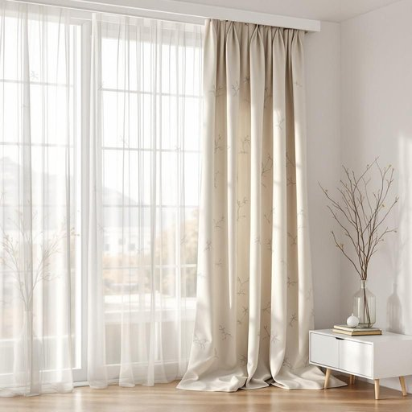

# drape

<h1 style="font-size: 2.5em; font-weight: 300; letter-spacing: 2px; margin: 0; color: #2c3e50;">
/dreɪp/
</h1>

---

---

## 例句

Although the living room was already filled with sunlight streaming through the large bay windows, the heavy velvet drape, intricately embroidered with silver threads and lined with blackout fabric, not only added a touch of elegance to the space but also proved indispensable for ensuring privacy during late evenings or when we wanted to block out the harsh daylight completely.

*Although(/ˌɔlˈðoʊ/) the(/ðə/) living(/ˈlɪvɪŋ/) room(/rum/) was(/wɑz/) already(/ɔˈrɛdi/) filled(/fɪld/) with(/wɪθ/) sunlight(/ˈsənˌlaɪt/) streaming(/ˈstrimɪŋ/) through(/θru/) the(/ðə/) large(/lɑrʤ/) bay(/beɪ/) windows,(/ˈwɪndoʊz,/) the(/ðə/) heavy(/ˈhɛvi/) velvet(/ˈvɛlvət/) drape,(/dreɪp,/) intricately(/ˈɪntrəkətli/) embroidered(/ɛmˈbrɔɪdərd/) with(/wɪθ/) silver(/ˈsɪlvər/) threads(/θrɛdz/) and(/ənd/) lined(/laɪnd/) with(/wɪθ/) blackout(/ˈblæˌkaʊt/) fabric,(/ˈfæbrɪk,/) not(/nɑt/) only(/ˈoʊnli/) added(/ˈædɪd/) a(/ə/) touch(/təʧ/) of(/əv/) elegance(/ˈɛləgəns/) to(/tɪ/) the(/ðə/) space(/speɪs/) but(/bət/) also(/ˈɔlsoʊ/) proved(/pruvd/) indispensable(/ˌɪndɪˈspɛnsəbəl/) for(/fər/) ensuring(/ɪnˈʃʊrɪŋ/) privacy(/ˈpraɪvəsi/) during(/ˈdʊrɪŋ/) late(/leɪt/) evenings(/ˈivnɪŋz/) or(/ər/) when(/wɪn/) we(/wi/) wanted(/ˈwɔntɪd/) to(/tɪ/) block(/blɑk/) out(/aʊt/) the(/ðə/) harsh(/hɑrʃ/) daylight(/ˈdeɪˌlaɪt/) completely.(/kəmˈplitli./)*

**翻译：** 虽然客厅已经被阳光透过宽大的飘窗洒满，但那幅由银线精致绣制、内衬遮光布料的厚重天鹅绒窗帘，不仅为空间增添了几分雅致，更在夜晚保障隐私或完全遮挡刺眼阳光时显得尤为重要。

---

## 解释

英语单词“drape”作为名词在家居生活用品的语境中，通常指的是悬挂的布料，具体多用于形容窗帘或装饰性布帘，强调布料的垂挂状态和柔软感，常见于描述室内装饰如“window drapes”（窗帘）或“drapes for the sofa”（沙发罩布）。学习者在使用“drape”作为名词时须注意，其复数形式为“drapes”，常与形容词搭配如“heavy drapes”（厚重的窗帘）、“silk drapes”（丝质窗帘）等，表达出不同材质或风格，搭配动词多用“hang drapes”、“draw the drapes”（拉窗帘）等，此外“drape”也多与视觉效果或季节氛围相关描述结合。语法上，“drape”作为名词一般用作具体可数名词，指特定的布帘件数。词源方面，“drape”源自中古法语“drap”及拉丁语“drappus”，原指布料或衣物，反映其与挂布、有布料覆盖之意的联系。在中文语境中，“drape”通常被译为“窗帘”或“挂布”，强调的是布料的垂挂特性，区别于较短或折叠式的“帘子”，更多体现在装饰和遮光功能。该词本身无明显褒贬色彩，但在室内设计领域多带有精致、优雅的文化内涵，常用于塑造温馨或奢华的家居氛围。

---

<small style="color: #999; font-size: 0.9em;">2025-07-17 06:22:39</small>

