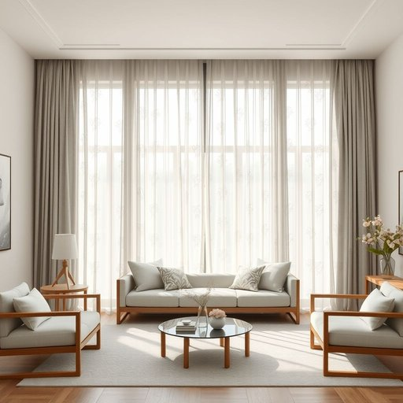

# drapery

<h1 style="font-size: 2.5em; font-weight: 300; letter-spacing: 2px; margin: 0; color: #2c3e50;">
/ˈdreɪpəri/
</h1>

---

---

## 例句

I spent the entire afternoon rearranging the living room so that the drapery, which features a subtle floral pattern and heavy velvet texture, not only complements the antique wooden furniture but also effectively blocks out the morning sun, creating a cozy atmosphere perfect for reading or relaxing.

*I(/aɪ/) spent(/spɛnt/) the(/ðə/) entire(/ɪnˈtaɪər/) afternoon(/ˌæftərˈnun/) rearranging(/ˌriərˈeɪnʤɪŋ/) the(/ðə/) living(/ˈlɪvɪŋ/) room(/rum/) so(/soʊ/) that(/ðət/) the(/ðə/) drapery,(/ˈdreɪpəri,/) which(/wɪʧ/) features(/ˈfiʧərz/) a(/ə/) subtle(/ˈsətəl/) floral(/ˈflɔrəl/) pattern(/ˈpætərn/) and(/ənd/) heavy(/ˈhɛvi/) velvet(/ˈvɛlvət/) texture,(/ˈtɛksʧər,/) not(/nɑt/) only(/ˈoʊnli/) complements(/ˈkɑmpləmənts/) the(/ðə/) antique(/ænˈtik/) wooden(/ˈwʊdən/) furniture(/ˈfərnɪʧər/) but(/bət/) also(/ˈɔlsoʊ/) effectively(/ˈifɛktɪvli/) blocks(/blɑks/) out(/aʊt/) the(/ðə/) morning(/ˈmɔrnɪŋ/) sun,(/sən,/) creating(/kriˈeɪtɪŋ/) a(/ə/) cozy(/ˈkoʊzi/) atmosphere(/ˈætməsˌfɪr/) perfect(/ˈpərˌfɪkt/) for(/fər/) reading(/ˈrɛdɪŋ/) or(/ər/) relaxing.(/rɪˈlæksɪŋ./)*

**翻译：** 我用整个下午的时间重新布置了客厅，使那带有细腻花纹且质地厚重的天鹅绒窗帘，不仅与古董木家具相得益彰，也能有效阻挡晨光，营造出一个既温馨又适合阅读或放松的氛围。

---

## 解释

英语单词“drapery”作为名词，在家居生活用品领域主要指悬挂的布料，包括窗帘、帷幔、装饰性布罩等，用以遮挡光线、美化空间或隔断区域。具体使用场合多见于描述房间装饰或窗户布置的语境，如“the drapery in the living room adds elegance”（客厅的窗帘增添了典雅感）。学习者需要注意，“drapery”通常是不可数名词，但也可复数形式“draperies”表示各种布帘或多件布料，常见搭配有“heavy drapery”（厚重窗帘）、“luxurious drapery”（豪华窗帘），在表达时常与颜色、材质、风格等词汇连用。在语法上，“drapery”可作主语、宾语或表语，且一般不单独使用冠词，除非强调特定窗帘如“the drapery”。词源上，“drapery”源自古法语“draperie”，进而来自拉丁语“drappus”，意指布料或纺织品，反映其最初为布匹或纺织品的涵义，后来演变为特指装饰性悬挂的布料。在中文语境中，“drapery”准确翻译为“窗帘”、“帷幔”或“布帘”，强调其装饰和功能性，与普通窗帘词汇相比更带有一定的雅致和装饰感。该词通常无褒贬色彩，属于中性词汇，偶尔在文学或室内设计中用来突出空间的正式或古典气氛，但并不含负面或特殊文化内涵。

---

<small style="color: #999; font-size: 0.9em;">2025-07-17 06:22:39</small>

