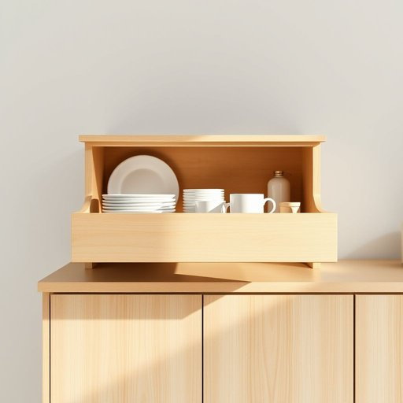

# drawer

<h1 style="font-size: 2.5em; font-weight: 300; letter-spacing: 2px; margin: 0; color: #2c3e50;">
/drɔr/
</h1>

---

---

## 例句

Could you please check the top drawer in the kitchen unit, where we usually keep the cutlery and those odd little bits and bobs that always seem to get lost behind the plates and mugs, before I start unpacking the groceries?

*Could(/kʊd/) you(/ju/) please(/pliz/) check(/ʧɛk/) the(/ðə/) top(/tɔp/) drawer(/drɔr/) in(/ɪn/) the(/ðə/) kitchen(/ˈkɪʧən/) unit,(/ˈjunɪt,/) where(/wɛr/) we(/wi/) usually(/ˈjuʒəwəli/) keep(/kip/) the(/ðə/) cutlery(/ˈkətləri/) and(/ənd/) those(/ðoʊz/) odd(/ɑd/) little(/ˈlɪtəl/) bits(/bɪts/) and(/ənd/) bobs(/bobs*/) that(/ðət/) always(/ˈɔlˌweɪz/) seem(/sim/) to(/tɪ/) get(/gɪt/) lost(/lɔst/) behind(/bɪˈhaɪnd/) the(/ðə/) plates(/pleɪts/) and(/ənd/) mugs,(/məgz,/) before(/ˌbiˈfɔr/) I(/aɪ/) start(/stɑrt/) unpacking(/ənˈpækɪŋ/) the(/ðə/) groceries?(/ˈgroʊsəriz?/)*

**翻译：** 在我开始整理杂货之前，你能帮我检查一下厨房柜子最上面那个抽屉吗？我们通常把餐具和那些零零散散的小东西放在那里，这些小东西总是容易被盘子和杯子挡在后面找不到。

---

## 解释

英语单词“drawer”在家居生活用品的语境中，作为名词主要指柜子、桌子或其他家具中可以拉出的抽屉，用于存放衣物、文具或其他小物件，常见于卧室、厨房和办公室等场合，英语学习者在使用该词时应注意其复数形式是“drawers”，且不能与表示“绘图者”或“提款人”的同音词混淆，常见搭配有“open the drawer”（打开抽屉）、“drawer handle”（抽屉把手）、“drawer space”（抽屉空间）等，表达时多用具体的形容词限定抽屉的大小、数量或用途，比如“a shallow drawer”（浅抽屉）、“a lockable drawer”（可上锁的抽屉），词源方面，“drawer”源自古英语“dragere”，意为“拖拉者”，与其拉出抽屉的动作相关联，逐渐引申为家具中可拉出的储物空间，在中文语境中，“drawer”准确译为“抽屉”，是家具中的标准部件，没有特殊的褒贬含义或文化色彩，属于中性词汇，使用时应结合具体家具和空间环境理解，以避免泛指“抽屉”以外的意义。

---

<small style="color: #999; font-size: 0.9em;">2025-07-17 06:22:39</small>

