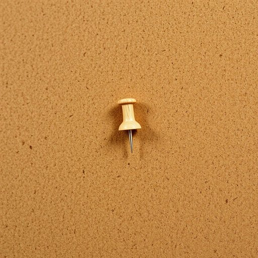

# drawing-pin

<h1 style="font-size: 2.5em; font-weight: 300; letter-spacing: 2px; margin: 0; color: #2c3e50;">
/drawing-pin*/
</h1>

---

---

## 例句

Could you please pass me a drawing-pin from the desk drawer, the one we usually use to pin up the children’s artwork on the corkboard, since I want to rearrange the photos and make sure everything stays firmly in place?

*Could(/kʊd/) you(/ju/) please(/pliz/) pass(/pæs/) me(/mi/) a(/ə/) drawing-pin(/drawing-pin*/) from(/frəm/) the(/ðə/) desk(/dɛsk/) drawer,(/drɔr,/) the(/ðə/) one(/wən/) we(/wi/) usually(/ˈjuʒəwəli/) use(/juz/) to(/tɪ/) pin(/pɪn/) up(/əp/) the(/ðə/) children’s(/children’s*/) artwork(/ˈɑrtˌwərk/) on(/ɔn/) the(/ðə/) corkboard,(/corkboard*,/) since(/sɪns/) I(/aɪ/) want(/wɔnt/) to(/tɪ/) rearrange(/riəreɪnʤ/) the(/ðə/) photos(/ˈfoʊˌtoʊz/) and(/ənd/) make(/meɪk/) sure(/ʃʊr/) everything(/ˈɛvriˌθɪŋ/) stays(/steɪz/) firmly(/ˈfərmli/) in(/ɪn/) place?(/pleɪs?/)*

**翻译：** 你能帮我从书桌抽屉里拿一枚图钉吗？就是我们平时用来把孩子们的作品钉在软木板上的那种，因为我打算重新排列照片，确保一切都稳固地固定着。

---

## 解释

英语单词"drawing-pin"作为名词，指的是一种小型的图钉，通常用于固定纸张或轻薄物品在软木板、墙面等处，常见于家庭、办公室和学校的生活场景中，其主要功能是便捷地将图画、通知或文件固定展示。学习者在使用"drawing-pin"时需注意其单数复数形式，复数通常为"drawing-pins"，且它作为可数名词时前面需加冠词如"a drawing-pin"或数量词，常见搭配包括"push a drawing-pin into the board"（将图钉插入软木板）或"remove the drawing-pins from the wall"（把墙上的图钉取下）。此外，"drawing-pin"在英式英语中更为普遍，而美式英语中相似物品多称为"thumbtack"。该词来源于draw（意为拉或画）与pin（针、别针）组合，最初指用于固定绘图纸的小别针，反映其历史上与绘画或制图活动的关联。在中文语境中，"drawing-pin"准确翻译为“图钉”或“图钉针”，表示用于插固定物的小钉子，无特殊褒贬色彩且为中性词汇，广泛应用于家居和办公环境，理解时应避免与大钉或钉书钉混淆，确保语境的准确性。

---

<small style="color: #999; font-size: 0.9em;">2025-07-17 06:22:39</small>

