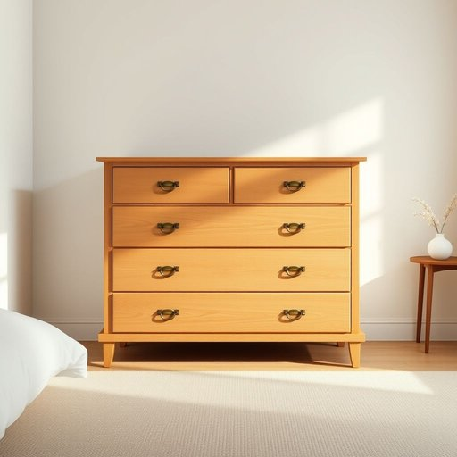

# dresser

<h1 style="font-size: 2.5em; font-weight: 300; letter-spacing: 2px; margin: 0; color: #2c3e50;">
/ˈdrɛsər/
</h1>

---

---

## 例句

After we finally decided to redecorate the bedroom entirely, my mum insisted that we find a vintage dresser, the kind with ornate brass handles and multiple deep drawers, because she believes it not only adds character but also provides ample storage space for all her linens and accessories.

*After(/ˈæftər/) we(/wi/) finally(/ˈfaɪnəli/) decided(/ˌdɪˈsaɪdɪd/) to(/tɪ/) redecorate(/riˈdɛkərˌeɪt/) the(/ðə/) bedroom(/ˈbɛˌdrum/) entirely,(/ɪnˈtaɪərli,/) my(/maɪ/) mum(/məm/) insisted(/ˌɪnˈsɪstɪd/) that(/ðət/) we(/wi/) find(/faɪnd/) a(/ə/) vintage(/ˈvɪntɪʤ/) dresser,(/ˈdrɛsər,/) the(/ðə/) kind(/kaɪnd/) with(/wɪθ/) ornate(/ɔrˈneɪt/) brass(/bræs/) handles(/ˈhændəlz/) and(/ənd/) multiple(/ˈməltəpəl/) deep(/dip/) drawers,(/drɔrz,/) because(/bɪˈkəz/) she(/ʃi/) believes(/bɪˈlivz/) it(/ɪt/) not(/nɑt/) only(/ˈoʊnli/) adds(/ædz/) character(/ˈkɛrɪktər/) but(/bət/) also(/ˈɔlsoʊ/) provides(/prəˈvaɪdz/) ample(/ˈæmpəl/) storage(/ˈstɔrɪʤ/) space(/speɪs/) for(/fər/) all(/ɔl/) her(/hər/) linens(/ˈlɪnənz/) and(/ənd/) accessories.(/ækˈsɛsəriz./)*

**翻译：** 在我们最终决定彻底重新装修卧室后，我妈妈坚持要找一款复古梳妆台，那种带有华丽黄铜把手和多个深抽屉的，因为她认为它不仅能增添空间的韵味，还能为她所有的床品和配饰提供充足的储藏空间。

---

## 解释

英语单词"dresser"在家居生活用品语境中作为名词，通常指带有抽屉的储物家具，主要用于储存衣物、化妆品或其他个人用品，常见于卧室或更衣室。具体使用场合包括描述卧室布置、家具购买或整理个人物品时，如“a wooden dresser for clothes”（用于衣物的木质梳妆柜）等表达。在语法规则上，"dresser"作为可数名词，单复数形式分别为"dresser"/"dressers"，常见搭配有"chest dresser"（带抽屉的柜子）、"vanity dresser"（带镜子和抽屉的梳妆台），还可与形容词连用如"large dresser"、"antique dresser"。英语学习者应注意，"dresser"在不同地区有细微差别，如在美式英语中多指装有抽屉的柜子，而在英式英语中有时也指梳妆台，语境不同含义略有变化，避免混淆。此外，"dresser"与"wardrobe"（衣柜）区别较大，前者注重抽屉存储，后者多指挂放衣物的立柜。词源方面，"dresser"来源于动词"dress"的派生词，原意为“穿衣者”或“梳妆者”，后引申为存放衣物或梳妆用品的家具，体现了其辅助穿戴和整理的功能。在中文语境中，"dresser"可译为“梳妆台”、“衣柜柜台”或“带抽屉的衣柜”，根据具体家具形态灵活理解，但通常强调其抽屉储物功能，无贬义或褒义的特殊色彩，属于中性词汇。在文化内涵上，"dresser"家具多与个人整理、生活细节的舒适性相关，反映西方家居对私密空间功能分区的讲究。综上，"dresser"作为家居名词既有实用功能的指向，也带有一定美学和生活习惯的文化背景，学习时应结合具体语境正确理解和使用。

---

<small style="color: #999; font-size: 0.9em;">2025-07-17 06:22:39</small>

