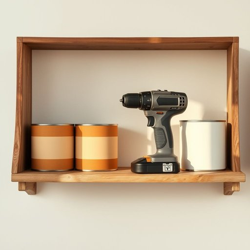

# drill

<h1 style="font-size: 2.5em; font-weight: 300; letter-spacing: 2px; margin: 0; color: #2c3e50;">
/drɪl/
</h1>

---

---

## 例句

Could you please pass me the drill that’s lying next to the stack of paint cans in the garage, the one with the longest battery life and multiple-speed settings, because I need to hang these shelves securely before the guests arrive this evening?

*Could(/kʊd/) you(/ju/) please(/pliz/) pass(/pæs/) me(/mi/) the(/ðə/) drill(/drɪl/) that’s(/that’s*/) lying(/laɪɪŋ/) next(/nɛkst/) to(/tɪ/) the(/ðə/) stack(/stæk/) of(/əv/) paint(/peɪnt/) cans(/kænz/) in(/ɪn/) the(/ðə/) garage,(/gərɑʒ,/) the(/ðə/) one(/wən/) with(/wɪθ/) the(/ðə/) longest(/ˈlɔŋgɪst/) battery(/ˈbætəri/) life(/laɪf/) and(/ənd/) multiple-speed(/multiple-speed*/) settings,(/ˈsɛtɪŋz,/) because(/bɪˈkəz/) I(/aɪ/) need(/nid/) to(/tɪ/) hang(/hæŋ/) these(/ðiz/) shelves(/ʃɛlvz/) securely(/sɪˈkjʊrli/) before(/ˌbiˈfɔr/) the(/ðə/) guests(/gɛsts/) arrive(/əraɪv/) this(/ðɪs/) evening?(/ˈivnɪŋ?/)*

**翻译：** 你能把车库里那堆油漆桶旁边的电钻递给我吗？就是那个电池续航最长、具有多档调速功能的，因为我需要在今晚客人到来之前把这些架子牢固地挂好。

---

## 解释

英语单词“drill”作为名词在家居生活用品的语境中，通常指电钻或手动钻，主要用于在木材、墙面、金属等材料上钻孔，是装修、修理和组装家具时常见的工具。使用时，多见于“electric drill”（电动钻）、“cordless drill”（无绳钻）、“drill bit”（钻头）等搭配，学习者应注意“drill”作为名词时一般不可数，但当指具体的钻头或钻孔次数时可以复数。语法上，“drill”作为工具名词通常用作主语或宾语，需与适当的动词连用，如“use a drill”（使用电钻）、“buy a drill”（买一把钻）。词源上，“drill”源自古英语“dryllian”或中古英语“drillen”，意为“穿孔”，最初指金属工匠用的穿孔工具，后来延伸为现代电动工具。中文中准确翻译为“电钻”或“钻机”，强调其在家居中的实用性和工具属性，无贬义或特殊文化色彩，但需注意区分“drill”作为名词“电钻”与动词“训练、操练”的不同含义。

---

<small style="color: #999; font-size: 0.9em;">2025-07-17 06:22:39</small>

