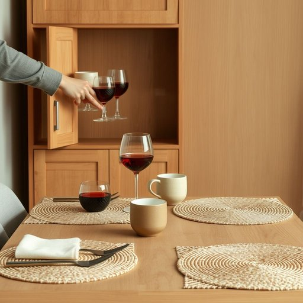

# drinkware

<h1 style="font-size: 2.5em; font-weight: 300; letter-spacing: 2px; margin: 0; color: #2c3e50;">
/drinkware*/
</h1>

---

---

## 例句

Before we set the table for tonight’s dinner party, could you please unpack the drinkware from the cupboard—especially the wine glasses and tumblers with intricate designs—since they’ll complement the freshly polished cutlery and the handwoven placemats perfectly?

*Before(/ˌbiˈfɔr/) we(/wi/) set(/sɛt/) the(/ðə/) table(/ˈteɪbəl/) for(/fər/) tonight’s(/tonight’s*/) dinner(/ˈdɪnər/) party,(/ˈpɑrti,/) could(/kʊd/) you(/ju/) please(/pliz/) unpack(/ənˈpæk/) the(/ðə/) drinkware(/drinkware*/) from(/frəm/) the(/ðə/) cupboard—especially(/cupboard—especially*/) the(/ðə/) wine(/waɪn/) glasses(/ˈglæsɪz/) and(/ənd/) tumblers(/ˈtəmblərz/) with(/wɪθ/) intricate(/ˈɪntrəkət/) designs—since(/designs—since*/) they’ll(/they’ll*/) complement(/ˈkɑmpləmənt/) the(/ðə/) freshly(/ˈfrɛʃli/) polished(/ˈpɑlɪʃt/) cutlery(/ˈkətləri/) and(/ənd/) the(/ðə/) handwoven(/ˈhænˈwoʊvən/) placemats(/placemats*/) perfectly?(/ˈpərfəktli?/)*

**翻译：** 在我们为今晚的晚宴摆桌之前，能否请你从柜子里取出酒具，尤其是那些带有精美图案的葡萄酒杯和水杯？它们与刚刚擦亮的餐具和手工编织的餐垫将完美相得益彰。

---

## 解释

英语单词"drinkware"作为名词，主要指用于盛装饮品的各种器具，如杯子、玻璃杯、马克杯、酒杯等，常见于家居生活用品的语境中，用以分类和描述厨房用具或餐饮相关的物品。使用时，"drinkware"通常是不可数名词，表示杯具的总体类别，常见搭配有"set of drinkware"（一套杯具）、"glass drinkware"（玻璃材质的杯具）等。学习者需注意，"drinkware"较为书面且专业，多用于商务交流、产品描述或商店商品分类，不如单词"cup"或"glass"日常通用。词源上，"drinkware"由"drink"（饮料、喝）和后缀"-ware"（用品、器具）构成，"-ware"在构词中常表示某种用途的物品，如"tableware"（餐具）、"silverware"（银器），体现其分类属性。在中文语境中，准确翻译为“饮具”或“杯具”，泛指用于饮水或饮料的器皿，属家居生活常用名词，无褒贬色彩，其文化内涵侧重于物品的功能性和生活实用性，用于强调产品类别而非特定细节。整体上，该词在室内装饰、家居用品市场以及相关英语环境中使用较为正式，适合描述和归类各类饮品盛放器具。

---

<small style="color: #999; font-size: 0.9em;">2025-07-17 06:22:39</small>

