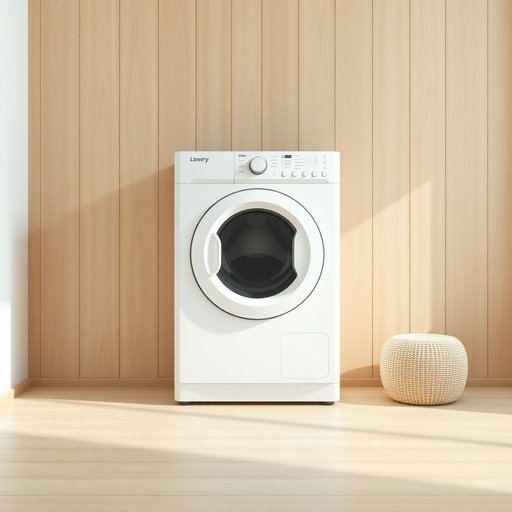

# dryer

<h1 style="font-size: 2.5em; font-weight: 300; letter-spacing: 2px; margin: 0; color: #2c3e50;">
/draɪər/
</h1>

---

---

## 例句

After I reluctantly decided to procrastinate, the overwhelming complexity of the assignment became undeniably apparent, compelling me to seek urgent help despite my initial confidence in handling the task independently.

*After(/ˈæftər/) I(/aɪ/) reluctantly(/rɪˈləktəntli/) decided(/ˌdɪˈsaɪdɪd/) to(/tɪ/) procrastinate,(/prəˈkræstəˌneɪt,/) the(/ðə/) overwhelming(/ˌoʊvərˈwɛlmɪŋ/) complexity(/kəmˈplɛksɪti/) of(/əv/) the(/ðə/) assignment(/əˈsaɪnmənt/) became(/bɪˈkeɪm/) undeniably(/ˌəndɪˈnaɪəbli/) apparent,(/əˈpɛrənt,/) compelling(/kəmˈpɛlɪŋ/) me(/mi/) to(/tɪ/) seek(/sik/) urgent(/ˈərʤənt/) help(/hɛlp/) despite(/dɪˈspaɪt/) my(/maɪ/) initial(/ˌɪˈnɪʃəl/) confidence(/ˈkɑnfədɛns/) in(/ɪn/) handling(/ˈhændəlɪŋ/) the(/ðə/) task(/tæsk/) independently.(/ˌɪndɪˈpɛndəntli./)*

**翻译：** 在我无奈地决定拖延之后，作业的复杂性变得无可否认地显现出来，迫使我在最初自信能够独立完成任务的情况下，紧急寻求帮助。

---

## 解释

英语单词'dryer'作为名词，在家居生活用品场景中主要指用于去除衣物、头发或其他物品水分的电器，最常见的是洗衣机的烘干机或吹风机，具体使用场合包括家中的洗衣房、浴室等，比如说clothes dryer指衣物烘干机，hair dryer指吹风机，英语学习者使用该词时需注意，dryer通常作为可数名词使用，前面一般带冠词a/an/the或数量词，同时常与名词搭配形成复合词，如hair dryer、tumble dryer或clothes dryer，表达时要注意词组的完整性和正确搭配，此外，dryer作为名词不用于形容词位置，但其复合名词成分中可作定语使用，词源上，dryer来自动词dry（使干燥）加后缀-er，表示执行该动作的装置或人，起源于中古英语，结构简单直白，体现了英语构词中常见的动词+er形式指工具的规律，在中文语境中，dryer准确翻译为干衣机、吹风机等，具体依上下文确定，涵盖各种去湿设备，无负面或褒义色彩，属于中性词汇，广泛应用于日常生活，总体而言，其使用简洁明了，功能明确，是家居必备电器的代称之一。

---

<small style="color: #999; font-size: 0.9em;">2025-07-17 06:22:39</small>

