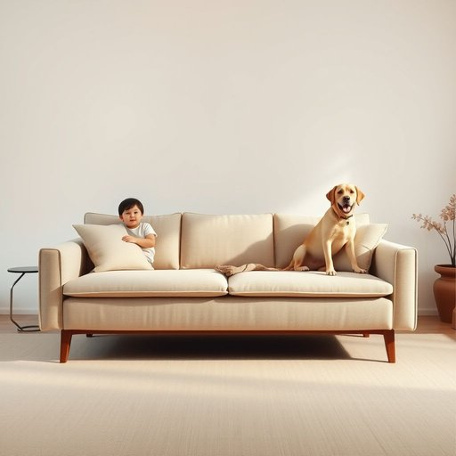

# durability

<h1 style="font-size: 2.5em; font-weight: 300; letter-spacing: 2px; margin: 0; color: #2c3e50;">
/dərəˈbɪlɪti/
</h1>

---

---

## 例句

Considering the hefty investment we’re making in this sofa, I think it’s crucial to prioritise its durability, especially since it will be subjected to daily wear and tear from both the kids and our rather energetic Labrador, which means we need upholstery that can withstand spills, scratches, and constant use without losing its charm.

*Considering(/kənˈsɪdərɪŋ/) the(/ðə/) hefty(/ˈhɛfti/) investment(/ˌɪnˈvɛstmənt/) we’re(/we’re*/) making(/ˈmeɪkɪŋ/) in(/ɪn/) this(/ðɪs/) sofa,(/ˈsoʊfə,/) I(/aɪ/) think(/θɪŋk/) it’s(/it’s*/) crucial(/ˈkruʃəl/) to(/tɪ/) prioritise(/prioritise*/) its(/ɪts/) durability,(/dərəˈbɪlɪti,/) especially(/əˈspɛʃəli/) since(/sɪns/) it(/ɪt/) will(/wɪl/) be(/bi/) subjected(/səˈbʤɛktɪd/) to(/tɪ/) daily(/ˈdeɪli/) wear(/wɛr/) and(/ənd/) tear(/tɪr/) from(/frəm/) both(/boʊθ/) the(/ðə/) kids(/kɪdz/) and(/ənd/) our(/ɑr/) rather(/ˈrəðər/) energetic(/ˌɛnərˈʤɛtɪk/) Labrador,(/ˈlæbrəˌdɔr,/) which(/wɪʧ/) means(/minz/) we(/wi/) need(/nid/) upholstery(/əˈpoʊlstəri/) that(/ðət/) can(/kən/) withstand(/wɪθˈstænd/) spills,(/spɪlz,/) scratches,(/ˈskræʧɪz,/) and(/ənd/) constant(/ˈkɑnstənt/) use(/juz/) without(/wɪˈθaʊt/) losing(/ˈluzɪŋ/) its(/ɪts/) charm.(/ʧɑrm./)*

**翻译：** 考虑到我们在这张沙发上的巨大投入，我认为优先保证其耐用性至关重要，尤其是它将承受孩子们和我们那只活力十足的拉布拉多犬的日常磨损，因此我们需要选用能够抵御液体溅洒、划痕及频繁使用且仍能保持美观的面料。

---

## 解释

“durability”作为名词，在家居生活用品的英语语境中主要指物品尤其是家具、家电、厨具等在日常使用过程中保持其功能和外观不受损坏、长时间耐用的性质或能力。具体使用场合多见于产品评价、广告宣传、消费者报告等，例如描述一把椅子的durability时，强调其材质和结构能够承受频繁使用而不易损坏。英语学习者在使用“durability”时应注意其不可数名词的性质，通常与形容词如“high durability”（高耐用性）、“excellent durability”（优良耐用性）以及动词短语如“improve durability”（提高耐用性）搭配较多，此外，它常与介词短语“durability of + 名词”连用，如“durability of the material”。该词源于拉丁语“durabilis”，意为“可持续的、坚固的”，由动词“durare”（持久、坚固）派生而来，反映了其本义上的持久性和坚固性。在中文语境中，最准确的翻译是“耐用性”或“持久性”，强调物品在使用过程中的经久不衰和抗损坏能力，通常为褒义词，表明质量优良，无特殊的贬义或文化负面内涵。理解“durability”时应注意其强调的是时间跨度上的稳固性能，而非即时强度或功能性，故使用时应与产品的使用寿命和质量保证等概念相结合。

---

<small style="color: #999; font-size: 0.9em;">2025-07-17 06:22:39</small>

