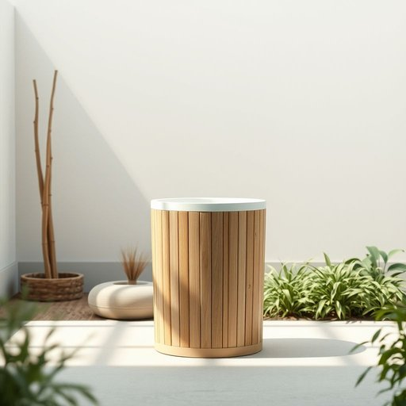

# dustbin

<h1 style="font-size: 2.5em; font-weight: 300; letter-spacing: 2px; margin: 0; color: #2c3e50;">
/ˈdəstbɪn/
</h1>

---

---

## 例句

Before you leave, could you please take out the rubbish to the dustbin in the garden, which is usually emptied every Thursday morning, ensuring that no leftover food or packaging is left inside to attract pests?

*Before(/ˌbiˈfɔr/) you(/ju/) leave,(/liv,/) could(/kʊd/) you(/ju/) please(/pliz/) take(/teɪk/) out(/aʊt/) the(/ðə/) rubbish(/ˈrəbɪʃ/) to(/tɪ/) the(/ðə/) dustbin(/ˈdəstbɪn/) in(/ɪn/) the(/ðə/) garden,(/ˈgɑrdən,/) which(/wɪʧ/) is(/ɪz/) usually(/ˈjuʒəwəli/) emptied(/ˈɛmtid/) every(/ˈɛvəri/) Thursday(/ˈθərzˌdeɪ/) morning,(/ˈmɔrnɪŋ,/) ensuring(/ɪnˈʃʊrɪŋ/) that(/ðət/) no(/noʊ/) leftover(/ˈlɛfˌtoʊvər/) food(/fud/) or(/ər/) packaging(/ˈpækɪʤɪŋ/) is(/ɪz/) left(/lɛft/) inside(/ˌɪnˈsaɪd/) to(/tɪ/) attract(/əˈtrækt/) pests?(/pɛsts?/)*

**翻译：** 在您离开之前，能否请您将垃圾带到花园里的垃圾桶中？该垃圾桶通常在每周四上午清理，请确保内部没有残留的食物或包装，以免吸引害虫。

---

## 解释

英语单词“dustbin”作为名词，主要指家庭或公共场所用来收集垃圾的容器，通常是室内厨房或室外庭院常见的垃圾桶，使用场合多为日常生活中需要处理废弃物的环境，如厨房的废纸、食品残渣或花园的落叶等。“dustbin”在语法上是可数名词，复数形式为“dustbins”，常见搭配包括“empty the dustbin”（清空垃圾桶）、“put rubbish in the dustbin”（把垃圾放进垃圾桶）等，学习者应注意其作为实物名词的直接使用及其复数变化；此外，在英式英语中使用更为普遍，美式英语中对应词通常是“trash can”或“garbage bin”。“dustbin”一词源自19世纪晚期，由“dust”（尘土、灰尘）与“bin”（箱、筐）组合而成，最初指用来盛放灰尘和细小垃圾的容器，逐渐演变成泛指一般废弃物的垃圾桶。在中文语境中，“dustbin”准确定义为“垃圾桶”或“废纸篓”，强调其作为收集生活垃圾的容器功能，不含贬义，但在某些习语或表达中，如“throw something in the dustbin”，引申为“丢弃、废弃某物”，可能带有否定或轻视的含义，总体上“dustbin”属于中性词，反映了日常家居环境中不可或缺的实用物品。

---

<small style="color: #999; font-size: 0.9em;">2025-07-17 06:22:39</small>

