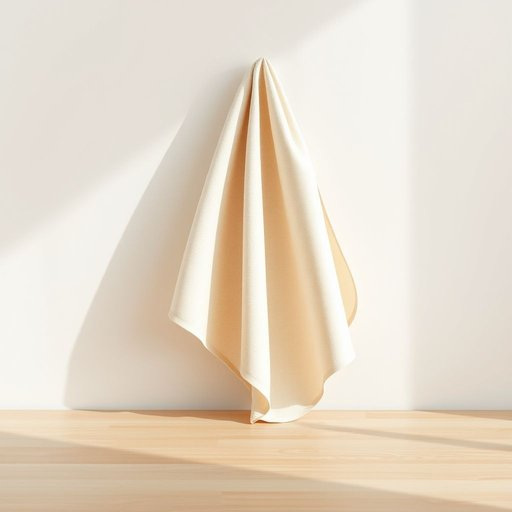

# dustcloth

<h1 style="font-size: 2.5em; font-weight: 300; letter-spacing: 2px; margin: 0; color: #2c3e50;">
/dustcloth*/
</h1>

---

---

## 例句

Before we start tidying up the living room, could you please find the dustcloth that’s usually tucked away in the kitchen drawer, the one with the soft texture which is perfect for delicately wiping down the wooden surfaces without leaving any scratches?

*Before(/ˌbiˈfɔr/) we(/wi/) start(/stɑrt/) tidying(/tidying*/) up(/əp/) the(/ðə/) living(/ˈlɪvɪŋ/) room,(/rum,/) could(/kʊd/) you(/ju/) please(/pliz/) find(/faɪnd/) the(/ðə/) dustcloth(/dustcloth*/) that’s(/that’s*/) usually(/ˈjuʒəwəli/) tucked(/təkt/) away(/əˈweɪ/) in(/ɪn/) the(/ðə/) kitchen(/ˈkɪʧən/) drawer,(/drɔr,/) the(/ðə/) one(/wən/) with(/wɪθ/) the(/ðə/) soft(/sɔft/) texture(/ˈtɛksʧər/) which(/wɪʧ/) is(/ɪz/) perfect(/ˈpərˌfɪkt/) for(/fər/) delicately(/ˈdɛləkətli/) wiping(/ˈwaɪpɪŋ/) down(/daʊn/) the(/ðə/) wooden(/ˈwʊdən/) surfaces(/ˈsərfəsɪz/) without(/wɪˈθaʊt/) leaving(/ˈlivɪŋ/) any(/ˈɛni/) scratches?(/ˈskræʧɪz?/)*

**翻译：** 在我们开始整理客厅之前，请帮忙找一下通常放在厨房抽屉里的那块软质抹布，它质地柔软，非常适合用来细致地擦拭木质表面，且不会留下划痕。

---

## 解释

英语单词"dustcloth"作为名词，在家居生活用品的语境中，指的是用来擦拭表面灰尘的布料，通常是柔软且适合吸附尘埃的织物，如抹布或除尘布，常用于家具、桌面、窗台等家居环境的清洁。使用时多出现在描述家庭清洁活动或家务劳动的场合，例如“Use a dustcloth to clean the shelves”（用抹布擦拭架子）。语法上，dustcloth作为可数名词，可以单数或复数形式出现，常见搭配有“a dustcloth”，“clean the table with a dustcloth”等，英语学习者在使用时需注意其具体指代的是清洁用布，不应混淆为其他类型的布料。词源上，“dustcloth”由“dust”（灰尘）和“cloth”（布）组成，是合成词，直接反映了其功能，即用于清洁灰尘的布，属于较为直白且功能性强的词汇。中文语境中，dustcloth准确翻译为“抹布”或“除尘布”，强调用于擦拭灰尘的清洁布，在日常家庭生活中使用频率较高，没有特殊的褒贬含义或文化色彩，属于中性词汇，表达清洁工具的含义，需结合具体语境选择合适的中文词汇以确保理解准确。

---

<small style="color: #999; font-size: 0.9em;">2025-07-17 06:22:39</small>

