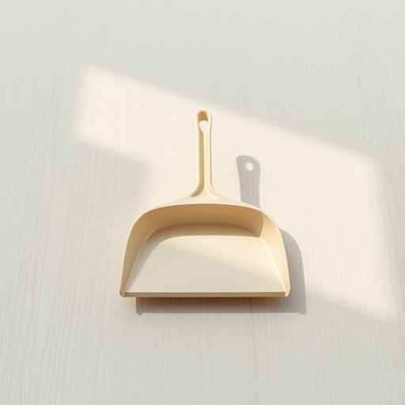

# dustpan

<h1 style="font-size: 2.5em; font-weight: 300; letter-spacing: 2px; margin: 0; color: #2c3e50;">
/dustpan*/
</h1>

---

---

## 例句

After accidentally knocking over the vase in the hallway, she quickly grabbed the dustpan, which was neatly tucked away under the kitchen sink alongside the broom and mop, and began sweeping up the shattered pieces before anyone else could see the mess.

*After(/ˈæftər/) accidentally(/ˌæksəˈdɛnəli/) knocking(/ˈnɑkɪŋ/) over(/ˈoʊvər/) the(/ðə/) vase(/vɑz/) in(/ɪn/) the(/ðə/) hallway,(/ˈhɔlˌweɪ,/) she(/ʃi/) quickly(/kˈwɪkli/) grabbed(/græbd/) the(/ðə/) dustpan,(/dustpan*,/) which(/wɪʧ/) was(/wɑz/) neatly(/ˈnitli/) tucked(/təkt/) away(/əˈweɪ/) under(/ˈəndər/) the(/ðə/) kitchen(/ˈkɪʧən/) sink(/sɪŋk/) alongside(/əˈlɔŋˈsaɪd/) the(/ðə/) broom(/brum/) and(/ənd/) mop,(/mɑp,/) and(/ənd/) began(/bɪˈgæn/) sweeping(/sˈwipɪŋ/) up(/əp/) the(/ðə/) shattered(/ˈʃætərd/) pieces(/ˈpisɪz/) before(/ˌbiˈfɔr/) anyone(/ˈɛniˌwən/) else(/ɛls/) could(/kʊd/) see(/si/) the(/ðə/) mess.(/mɛs./)*

**翻译：** 她不小心撞倒了走廊里的花瓶，迅速抓起整齐收在厨房水槽下，与扫帚和拖把并排放置的簸箕，开始清扫碎片，生怕被别人看到这场凌乱。

---

## 解释

英语单词"dustpan"作为名词，指的是家居生活中用于配合扫帚收集扫落灰尘、垃圾的小铲状容器，通常具有一个手柄和一个宽口平底，方便将地上的尘土扫入内部，常见于打扫卫生时的工具。具体使用场合多在居家清洁或清扫的语境中，如“Please bring the dustpan so I can sweep up the broken glass”（请拿来簸箕，我要把碎玻璃扫起来）。英语学习者使用"dustpan"时需要注意它作为可数名词，一般前面需加冠词（a dustpan/the dustpan），且常与动词“use”，“pick up”，“empty”等搭配，常见表达还包括“dustpan and brush”（簸箕和刷子，指扫帚小组合），“dustpan set”等。词源上，“dustpan”由“dust”（尘埃）和“pan”（盘、盘子）组合而成，直译为“装尘埃的盘子”，源自17世纪以来的英语日常用具命名，反映其功能性。其在中文中准确翻译为“簸箕”，是家居清扫的必备工具，含义明确，无特殊褒贬色彩或文化内涵，但在不同地区有不同叫法，如北方多称“簸箕”，南方部分地区可能称“簸箕板”或“尘盘”，理解时应结合实际语境。总之，"dustpan"是描述家庭清洁工具中不可缺少的小物件，使用时注意其可数属性和与扫帚的配合关系，文化色彩中性，广泛适用于生活中的清扫场景。

---

<small style="color: #999; font-size: 0.9em;">2025-07-17 06:22:39</small>

