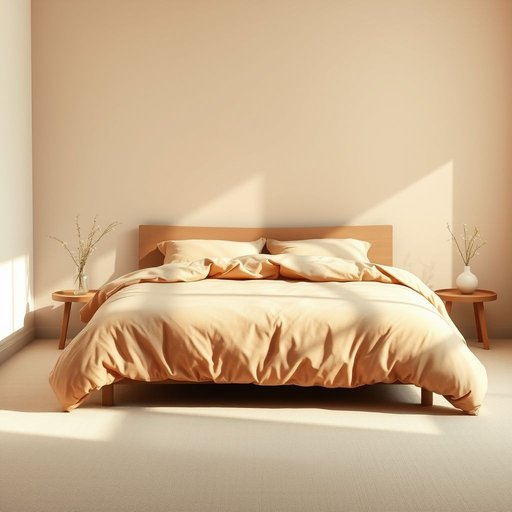

# duvet-cover

<h1 style="font-size: 2.5em; font-weight: 300; letter-spacing: 2px; margin: 0; color: #2c3e50;">
/duvet-cover*/
</h1>

---

---

## 例句

I spent the whole afternoon rearranging the bedroom, carefully selecting a new duvet-cover with a subtle floral pattern that not only complements the soft pastel walls but also feels cozy against the skin, because I wanted our space to be both visually inviting and incredibly comfortable for those chilly winter nights.

*I(/aɪ/) spent(/spɛnt/) the(/ðə/) whole(/hoʊl/) afternoon(/ˌæftərˈnun/) rearranging(/ˌriərˈeɪnʤɪŋ/) the(/ðə/) bedroom,(/ˈbɛˌdrum,/) carefully(/ˈkɛrfəli/) selecting(/səˈlɛktɪŋ/) a(/ə/) new(/nu/) duvet-cover(/duvet-cover*/) with(/wɪθ/) a(/ə/) subtle(/ˈsətəl/) floral(/ˈflɔrəl/) pattern(/ˈpætərn/) that(/ðət/) not(/nɑt/) only(/ˈoʊnli/) complements(/ˈkɑmpləmənts/) the(/ðə/) soft(/sɔft/) pastel(/pæˈstɛl/) walls(/wɔlz/) but(/bət/) also(/ˈɔlsoʊ/) feels(/filz/) cozy(/ˈkoʊzi/) against(/əˈgɛnst/) the(/ðə/) skin,(/skɪn,/) because(/bɪˈkəz/) I(/aɪ/) wanted(/ˈwɔntɪd/) our(/ɑr/) space(/speɪs/) to(/tɪ/) be(/bi/) both(/boʊθ/) visually(/ˈvɪʒwəli/) inviting(/ˌɪnˈvaɪtɪŋ/) and(/ənd/) incredibly(/ˌɪnˈkrɛdəbli/) comfortable(/ˈkəmfərtəbəl/) for(/fər/) those(/ðoʊz/) chilly(/ˈʧɪli/) winter(/ˈwɪntər/) nights.(/naɪts./)*

**翻译：** 我花了整个下午重新布置卧室，细心挑选了一款淡雅花纹的新被套，这款被套不仅与柔和的浅色墙面相得益彰，而且贴肤感舒适，因为我希望我们的空间既赏心悦目，又能在寒冷的冬夜带来无比温馨的感受。

---

## 解释

“duvet-cover”作为名词主要指覆盖羽绒被或厚被子的外罩套，通常用来保护被芯，便于清洗和更换，常见于卧室家居用品中。使用场合多是在描述卧室布置、床上用品购买或清洁维护时，语境通常涉及舒适、实用和装饰功能。对于英语学习者来说，注意“duvet-cover”通常是复合名词，且多以单数形式出现，复数形式为“duvet covers”；搭配常见表达有“put on a duvet-cover”（套上被罩）、“remove the duvet-cover”（取下被罩）、以及描述材质时与“cotton duvet cover”或“silk duvet cover”等连用。此外，作为名词，它与“duvet”区分明显，后者指内芯，被套则是外层保护和装饰物。词源方面，“duvet”源自法语，意为“羽绒”，其中“duvet-cover”即为“羽绒被罩”，体现了英美家居用语中对法语借词的采用。中文语境中，“duvet-cover”准确翻译为“羽绒被套”或简称“被套”，强调其保护和装饰羽绒被的功能，无褒贬色彩，常见于大众家居用语中，属于中性词汇，体现了一种舒适生活方式和床上用品的现代管理方式。

---

<small style="color: #999; font-size: 0.9em;">2025-07-17 06:22:39</small>

