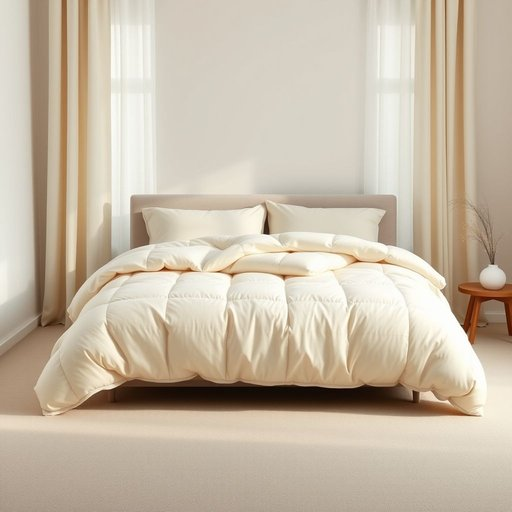

# duvet

<h1 style="font-size: 2.5em; font-weight: 300; letter-spacing: 2px; margin: 0; color: #2c3e50;">
/duvet*/
</h1>

---

---

## 例句

When I woke up this morning, I realised that the duvet, which my partner had carefully chosen for its warmth and softness last winter, was perfectly tucked in, covering the entire bed and making it impossible to get out without disturbing the peaceful comfort it provided.

*When(/wɪn/) I(/aɪ/) woke(/woʊk/) up(/əp/) this(/ðɪs/) morning,(/ˈmɔrnɪŋ,/) I(/aɪ/) realised(/ˈriəˌlaɪzd/) that(/ðət/) the(/ðə/) duvet,(/duvet*,/) which(/wɪʧ/) my(/maɪ/) partner(/ˈpɑrtnər/) had(/hæd/) carefully(/ˈkɛrfəli/) chosen(/ˈʧoʊzən/) for(/fər/) its(/ɪts/) warmth(/wɔrmθ/) and(/ənd/) softness(/ˈsɔftnəs/) last(/læst/) winter,(/ˈwɪntər,/) was(/wɑz/) perfectly(/ˈpərfəktli/) tucked(/təkt/) in,(/ɪn,/) covering(/ˈkəvərɪŋ/) the(/ðə/) entire(/ɪnˈtaɪər/) bed(/bɛd/) and(/ənd/) making(/ˈmeɪkɪŋ/) it(/ɪt/) impossible(/ˌɪmˈpɑsəbəl/) to(/tɪ/) get(/gɪt/) out(/aʊt/) without(/wɪˈθaʊt/) disturbing(/dɪˈstərbɪŋ/) the(/ðə/) peaceful(/ˈpisfəl/) comfort(/ˈkəmfərt/) it(/ɪt/) provided.(/prəˈvaɪdɪd./)*

**翻译：** 今晨醒来时，我发现那条去年冬天我的伴侣细心挑选的被子，因其温暖与柔软而备受青睐，已被完美地掖好，铺满整张床，使我几乎无法起身，而不打扰它所营造的那份宁静安逸。

---

## 解释

“duvet”作为名词在家居生活用品的语境中，指的是一种用柔软的羽绒或合成纤维填充的被褥，通常套有布套，用于盖被保暖，尤其在卧室睡眠环境中非常常见。英语学习者在使用“duvet”时应注意它是可数名词，常见的搭配包括“duvet cover”（被套）、“down duvet”（羽绒被）、“thick duvet”（厚被子）等，表达时通常结合形容词描述其材质、厚度和保暖性。语法上，“duvet”前可用不定冠词“a”，复数形式为“duvets”。词源上，“duvet”源自法语，原意为“羽绒”，进入英语后特指羽绒被，体现了其柔软轻盈且保暖的特点。在中文语境中，“duvet”准确翻译为“羽绒被”或简称“被子”，强调其填充材料和保暖功能，与普通棉被相比更轻便且保暖性更佳。该词在英语中无特殊褒贬色彩，属于中性词汇，反映的是西方睡眠文化中对舒适睡眠环境的注重。在表达上，英语国家家庭日常谈论床上用品时“duvet”十分常见，是描述卧室被褥不可或缺的词汇之一。

---

<small style="color: #999; font-size: 0.9em;">2025-07-17 06:22:39</small>

